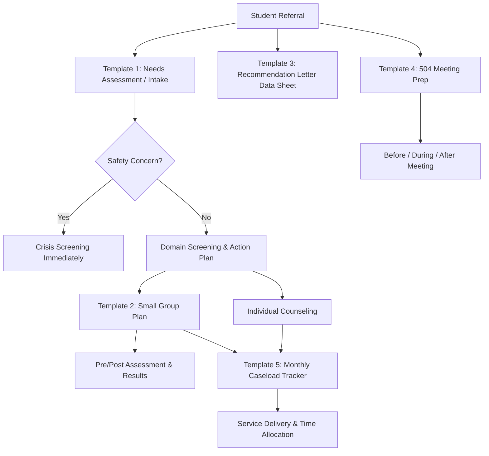

# Counselor Templates — Caseload Management & Student Support

## Table of Contents
- [Template 1: Student Needs Assessment / Intake](#template-1-student-needs-assessment-intake)
  - [Presenting Concern](#presenting-concern)
  - [Domain Screening](#domain-screening)
  - [Background](#background)
  - [Student's Own Words](#students-own-words)
  - [Action Plan](#action-plan)
- [Template 2: Small Group Counseling Plan](#template-2-small-group-counseling-plan)
  - [Group Members](#group-members)
  - [ASCA Mindsets & Behaviors Addressed](#asca-mindsets-behaviors-addressed)
  - [Session Outlines](#session-outlines)
  - [Pre/Post Assessment](#prepost-assessment)
  - [Results (Complete After Group Ends)](#results-complete-after-group-ends)
- [Template 3: Recommendation Letter Data Sheet](#template-3-recommendation-letter-data-sheet)
  - [Academic Profile](#academic-profile)
  - [Activities & Leadership](#activities-leadership)
  - [Work / Volunteer Experience](#work-volunteer-experience)
- [Template 4: 504 Meeting Prep Checklist](#template-4-504-meeting-prep-checklist)
  - [Before the Meeting](#before-the-meeting)
  - [During the Meeting](#during-the-meeting)
  - [After the Meeting](#after-the-meeting)
- [Template 5: Counselor Monthly Caseload Tracker](#template-5-counselor-monthly-caseload-tracker)
  - [Service Delivery This Month](#service-delivery-this-month)
  - [Time Allocation (estimate %)](#time-allocation-estimate)
  - [Students of Concern](#students-of-concern)
  - [Referrals Made](#referrals-made)

## Template 1: Student Needs Assessment / Intake

**Student:** ___________________________ **Grade:** _____ **Date:** _______________
**Referred by:** ☐ Self ☐ Teacher: ___ ☐ Parent ☐ Admin ☐ Peer ☐ Other: ___
**Counselor:** ___________________________

### Presenting Concern
**What brings the student to the counselor?**

_______________________________________________________________________________
_______________________________________________________________________________

### Domain Screening

| Domain | Concern? | Notes |
|--------|----------|-------|
| **Academic** (grades, attendance, motivation, study skills) | ☐ Yes ☐ No | |
| **Career** (interests, post-secondary planning, career exploration) | ☐ Yes ☐ No | |
| **Social-emotional** (anxiety, depression, anger, relationships, grief) | ☐ Yes ☐ No | |
| **Behavioral** (discipline referrals, classroom conduct, substance use) | ☐ Yes ☐ No | |
| **Family** (divorce, instability, housing, abuse/neglect concerns) | ☐ Yes ☐ No | |
| **Safety** (self-harm, suicidal ideation, bullying, threats) | ☐ Yes ☐ No | |

**If Safety is checked → conduct risk screening immediately (see crisis screening checklist)**

### Background

| Factor | Details |
|--------|---------|
| Current GPA | |
| Attendance this year | ___% (___absences) |
| Discipline referrals | |
| IEP / 504 / ELL status | |
| Living situation | |
| Significant recent events | |

### Student's Own Words
*What does the student say they need?*

_______________________________________________________________________________

### Action Plan

| Priority | Action | Who | Timeline |
|----------|--------|-----|----------|
| 1 | | | |
| 2 | | | |
| 3 | | | |

**Follow-up date:** _______________ **Parent contact:** ☐ Yes ☐ Not yet — reason: ___

---

## Template 2: Small Group Counseling Plan

**Group topic:** ___________________________ **Grade level:** _____
**Counselor:** ___________________________ **Start date:** _______________
**Number of sessions:** _____ **Session length:** _____ minutes
**Meeting day/time:** ___________________________

### Group Members

| Student | Grade | Reason for Inclusion | Parent Consent? |
|---------|-------|---------------------|----------------|
| | | | ☐ Yes ☐ Pending |
| | | | ☐ Yes ☐ Pending |
| | | | ☐ Yes ☐ Pending |
| | | | ☐ Yes ☐ Pending |
| | | | ☐ Yes ☐ Pending |
| | | | ☐ Yes ☐ Pending |

### ASCA Mindsets & Behaviors Addressed
*(Reference the ASCA Student Standards: Mindsets & Behaviors for Student Success)*

| Standard Code | Description |
|--------------|-------------|
| | |
| | |

### Session Outlines

| Session | Topic | Objective | Activity | Materials |
|---------|-------|-----------|---------|-----------|
| 1 | Group norms, introductions | Build trust, set expectations | | |
| 2 | | | | |
| 3 | | | | |
| 4 | | | | |
| 5 | | | | |
| 6 | Review, closure, next steps | Reflect on growth, plan forward | | |

### Pre/Post Assessment
**How will you measure growth?**
☐ Pre/post survey (attached)
☐ Rating scale (1-5 on target skills)
☐ Behavioral data (attendance, referrals, grades)
☐ Other: _______________

### Results (Complete After Group Ends)

| Student | Pre-Score | Post-Score | Change | Notes |
|---------|-----------|-----------|--------|-------|
| | | | | |
| | | | | |
| | | | | |

**Outcome summary:** _______________________________________________

---

## Template 3: Recommendation Letter Data Sheet

**Student:** ___________________________ **Grade:** _____
**Requesting for:** ☐ College ☐ Scholarship ☐ Job ☐ Program ☐ Other: ___
**Due date:** _______________ **Submit to:** ___________________________

*Student: Complete this form and return it to your counselor at least 3 weeks before the deadline.*

### Academic Profile
- GPA (weighted / unweighted): _____ / _____
- Class rank (if available): _____ of _____
- ACT/SAT score: _____
- Most rigorous courses taken: _______________________________________________
- Intended major/career: _______________________________________________

### Activities & Leadership
| Activity | Years | Leadership Role |
|----------|-------|----------------|
| | | |
| | | |
| | | |
| | | |

### Work / Volunteer Experience
| Organization | Role | Hours/Week | Duration |
|-------------|------|-----------|----------|
| | | | |
| | | | |

### What makes you unique?
*What should the letter highlight? What are you most proud of? What challenge have you overcome?*

_______________________________________________________________________________
_______________________________________________________________________________
_______________________________________________________________________________

### What are your goals?
*Why this college/scholarship/program? How does it connect to your plans?*

_______________________________________________________________________________
_______________________________________________________________________________

### Anything else the counselor should know?
_______________________________________________________________________________

---

## Template 4: 504 Meeting Prep Checklist

**Student:** ___________________________ **Meeting Date:** _______________
**Meeting Type:** ☐ Initial ☐ Annual Review ☐ Re-evaluation ☐ Amendment
**Counselor / 504 Coordinator:** ___________________________

### Before the Meeting
- [ ] Notify parent (written notice, at least 7 days prior when possible)
- [ ] Confirm parent can attend; offer alternatives if needed (phone, reschedule)
- [ ] Invite all required team members:
  - [ ] Parent/guardian
  - [ ] General education teacher(s)
  - [ ] 504 coordinator
  - [ ] Administrator or designee
  - [ ] Other: _______________
- [ ] Gather current data:
  - [ ] Grades and attendance
  - [ ] Teacher input forms (from each teacher)
  - [ ] Medical documentation (if initial or re-eval)
  - [ ] Discipline records
  - [ ] Standardized test scores with accommodations used
  - [ ] Prior 504 plan (if review/amendment)
- [ ] Prepare 504 plan template or current plan for review
- [ ] Reserve meeting room

### During the Meeting
- [ ] Review: Is the student still eligible? Does the disability still substantially limit a major life activity?
- [ ] Review current accommodations — are they working? Teacher feedback?
- [ ] Add, remove, or modify accommodations as needed
- [ ] Discuss testing accommodations for state assessments (MAP/EOC)
- [ ] Set next review date (must be at least annual)
- [ ] Ensure parent understands rights: receive copy, request changes, file grievance

### After the Meeting
- [ ] Finalize and distribute 504 plan to:
  - [ ] Parent (copy provided at or after meeting)
  - [ ] All current teachers
  - [ ] School nurse (if health-related)
  - [ ] Student's file
  - [ ] Any relevant support staff
- [ ] Enter review date in calendar for next year
- [ ] Update SIS / tracking system

---

## Template 5: Counselor Monthly Caseload Tracker

**Counselor:** ___________________________ **Month:** _______________
**Total caseload:** _____ students

### Service Delivery This Month

| Service Type | Count | Notes |
|-------------|-------|-------|
| Individual counseling sessions | | |
| Small group sessions | | |
| Classroom guidance lessons | | |
| Crisis interventions | | |
| College/career conferences | | |
| Parent conferences | | |
| Teacher consultations | | |
| 504 meetings | | |
| IEP meetings attended | | |
| Student schedule changes | | |
| Other: ___ | | |

### Time Allocation (estimate %)

| Activity | % of Time | ASCA Target |
|----------|----------|-------------|
| Direct student services (counseling, guidance, advising) | ___% | 80%+ |
| Indirect services (consultation, referral, collaboration) | ___% | included in 80% |
| Program management (data, planning, calendaring) | ___% | ~20% |
| Non-counseling duties (testing, scheduling, discipline, lunch duty) | ___% | minimize |

**Non-counseling duties this month (to discuss with admin):**
_______________________________________________________________________________

### Students of Concern

| Student | Grade | Concern | Status | Follow-Up |
|---------|-------|---------|--------|----------|
| | | | | |
| | | | | |
| | | | | |

### Referrals Made

| Student | Referred To | Reason | Date | Follow-Up |
|---------|-----------|--------|------|----------|
| | | | | |
| | | | | |

### Notes for Monthly Report / Annual Results Report
_______________________________________________________________________________
