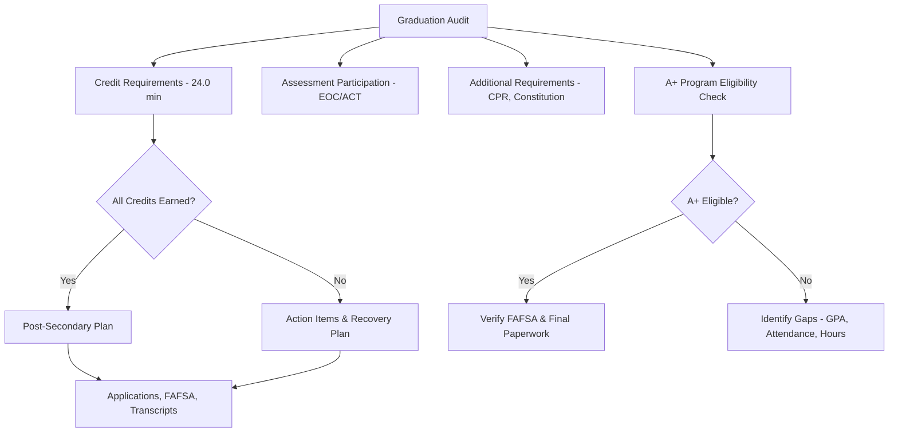

# Student Graduation Audit — Template

**Student:** ___________________________________ **ID:** _______________
**School:** ___________________________________ **Expected Graduation:** _______________
**Counselor:** ___________________________________ **Audit Date:** _______________

---

## Credit Requirements (24.0 Minimum — Verify District Requirements)

| Subject | Required | Earned | In Progress | Remaining | Notes |
|---------|----------|--------|-------------|-----------|-------|
| English Language Arts | 4.0 | | | | |
| Mathematics (incl. Algebra I+) | 3.0 | | | | |
| Science (incl. 1 lab science) | 3.0 | | | | |
| Social Studies (Am Hist, Am Gov, World Hist) | 3.0 | | | | |
| Fine Arts | 1.0 | | | | |
| Practical Arts | 1.0 | | | | |
| Physical Education | 1.0 | | | | |
| Health | 0.5 | | | | |
| Personal Finance (RSMo 170.013) | 0.5 | | | | |
| Electives | 7.0 | | | | |
| **TOTAL** | **24.0** | | | | |

**District additional requirements (if any):** ___________________________________

---

## Assessment Participation

| Assessment | Subject | Participated? | Score | Notes |
|-----------|---------|--------------|-------|-------|
| EOC — English II | ELA | ☐ Yes ☐ No | | |
| EOC — Algebra I | Math | ☐ Yes ☐ No | | |
| EOC — Biology | Science | ☐ Yes ☐ No | | |
| EOC — Am. Government | SS | ☐ Yes ☐ No | | |
| ACT (Grade 11) | Composite | ☐ Yes ☐ No | | |

---

## Additional Requirements

| Requirement | Status | Notes |
|-------------|--------|-------|
| CPR instruction (RSMo 170.310) | ☐ Complete ☐ Incomplete | |
| U.S./MO Constitution requirement | ☐ Complete ☐ Incomplete | Verify district policy |

---

## A+ Program Eligibility Check

| Criterion | Status | Details |
|-----------|--------|---------|
| Attended A+ school 3 consecutive years | ☐ Met ☐ Not met | Entry date: ___________ |
| Cumulative GPA ≥ 2.5 | ☐ Met ☐ Not met | Current GPA: ___________ |
| Cumulative attendance ≥ 95% | ☐ Met ☐ Not met | Current: ___________% |
| 50 hours tutoring/mentoring | ☐ Met ☐ Not met | Hours logged: ___________ |
| Good citizenship | ☐ Met ☐ Not met | |
| FAFSA completed (or waiver) | ☐ Met ☐ Not met | |
| Algebra I EOC proficient/advanced (or alt) | ☐ Met ☐ Not met | Score: ___________ |

**A+ Eligible:** ☐ Yes ☐ No ☐ Pending — Action needed: ___________________________________

---

## Post-Secondary Plan

| Element | Detail |
|---------|--------|
| Post-secondary goal | ☐ 4-year ☐ Community college ☐ Technical ☐ Military ☐ Workforce ☐ Apprenticeship |
| Applications submitted | |
| Financial aid status | ☐ FAFSA complete ☐ Scholarships applied ☐ A+ verified |
| ACT/SAT scores sent | |
| Transcript requests | |

---

## Action Items

| Issue | Action | Responsible | Deadline | Status |
|-------|--------|------------|----------|--------|
| | | | | |
| | | | | |
| | | | | |

**Student signature:** ___________________________________ **Date:** _______________
**Parent/Guardian signature:** ___________________________________ **Date:** _______________
**Counselor signature:** ___________________________________ **Date:** _______________
