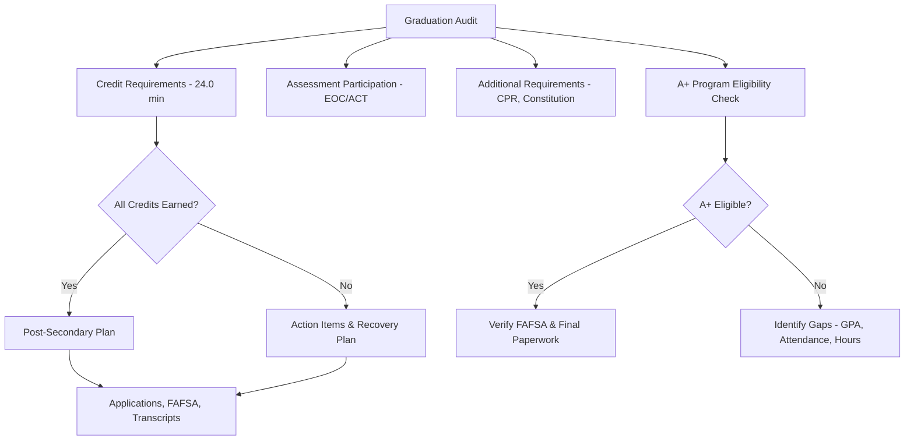

# Student Graduation Audit — Template

**Student:** ___________________________________ **ID:** _______________
**School:** ___________________________________ **Expected Graduation:** _______________
**Counselor:** ___________________________________ **Audit Date:** _______________

---

## Credit Requirements (24.0 Minimum — Verify District Requirements)

| Subject | Required | Earned | In Progress | Remaining | Notes |
|---------|----------|--------|-------------|-----------|-------|
| English Language Arts | 4.0 | | | | |
| Mathematics (incl. Algebra I+) | 3.0 | | | | |
| Science (incl. 1 lab science) | 3.0 | | | | |
| Social Studies (Am Hist, Am Gov, World Hist) | 3.0 | | | | |
| Fine Arts | 1.0 | | | | |
| Practical Arts | 1.0 | | | | |
| Physical Education | 1.0 | | | | |
| Health | 0.5 | | | | |
| Personal Finance (RSMo 170.013) | 0.5 | | | | |
| Electives | 7.0 | | | | |
| **TOTAL** | **24.0** | | | | |

**District additional requirements (if any):** ___________________________________

---

## Assessment Participation

| Assessment | Subject | Participated? | Score | Notes |
|-----------|---------|--------------|-------|-------|
| EOC — English II | ELA | ☐ Yes ☐ No | | |
| EOC — Algebra I | Math | ☐ Yes ☐ No | | |
| EOC — Biology | Science | ☐ Yes ☐ No | | |
| EOC — Am. Government | SS | ☐ Yes ☐ No | | |
| ACT (Grade 11) | Composite | ☐ Yes ☐ No | | |

---

## Additional Requirements

| Requirement | Status | Notes |
|-------------|--------|-------|
| CPR instruction (RSMo 170.310) | ☐ Complete ☐ Incomplete | |
| U.S./MO Constitution requirement | ☐ Complete ☐ Incomplete | Verify district policy |

---

## [A+ Program](../../references/roles/students.md) Eligibility Check

| Criterion | Status | Details |
|-----------|--------|---------|
| Attended A+ school 3 consecutive years | ☐ Met ☐ Not met | Entry date: ___________ |
| Cumulative GPA ≥ 2.5 | ☐ Met ☐ Not met | Current GPA: ___________ |
| Cumulative attendance ≥ 95% | ☐ Met ☐ Not met | Current: ___________% |
| 50 hours tutoring/mentoring | ☐ Met ☐ Not met | Hours logged: ___________ |
| Good citizenship | ☐ Met ☐ Not met | |
| FAFSA completed (or waiver) | ☐ Met ☐ Not met | |
| Algebra I EOC proficient/advanced (or alt) | ☐ Met ☐ Not met | Score: ___________ |

**A+ Eligible:** ☐ Yes ☐ No ☐ Pending — Action needed: ___________________________________

---

## Post-Secondary Plan

| Element | Detail |
|---------|--------|
| Post-secondary goal | ☐ 4-year ☐ Community college ☐ Technical ☐ Military ☐ Workforce ☐ Apprenticeship |
| Applications submitted | |
| Financial aid status | ☐ FAFSA complete ☐ Scholarships applied ☐ A+ verified |
| ACT/SAT scores sent | |
| Transcript requests | |

---

## Action Items

| Issue | Action | Responsible | Deadline | Status |
|-------|--------|------------|----------|--------|
| | | | | |
| | | | | |
| | | | | |

**Student signature:** ___________________________________ **Date:** _______________
**Parent/Guardian signature:** ___________________________________ **Date:** _______________
**Counselor signature:** ___________________________________ **Date:** _______________

---

## Related Resources

- [Students & Parents Reference](../../references/roles/students.md) -- graduation requirements, A+ Scholarship details, and college readiness
- [School Counseling Reference](../../references/roles/school-counseling.md) -- counselor role in academic planning and college advising
- [Assessments](../../references/operations/assessments.md) -- EOC exam details, MAP, ACT, and assessment accommodations
- [Specialists (IEP & 504)](../../references/roles/specialists.md) -- modified graduation requirements for students with IEPs
- [Counselor Checklists](../../templates/counselor/checklists.md) -- additional counselor planning and tracking tools

---

### Worked Example — Completed Graduation Audit

**Student:** Maria Gonzalez **ID:** 20230456
**School:** Lincoln High School **Expected Graduation:** May 2026
**Counselor:** Mr. Kevin Park **Audit Date:** 04/01/2026

---

#### Credit Requirements (24.0 Minimum)

| Subject | Required | Earned | In Progress | Remaining | Notes |
|---------|----------|--------|-------------|-----------|-------|
| English Language Arts | 4.0 | 4.0 | 0 | 0 | Complete |
| Mathematics (incl. Algebra I+) | 3.0 | 3.0 | 0 | 0 | Algebra I, Geometry, Algebra II — complete |
| Science (incl. 1 lab science) | 3.0 | 1.5 | 0.5 | **1.0** | Biology (1.0) earned; Chemistry in progress (0.5 earned of 1.0); needs 1.0 more — see action items |
| Social Studies (Am Hist, Am Gov, World Hist) | 3.0 | 3.0 | 0 | 0 | Complete |
| Fine Arts | 1.0 | 1.0 | 0 | 0 | Art I |
| Practical Arts | 1.0 | 1.0 | 0 | 0 | Intro to Business |
| Physical Education | 1.0 | 1.0 | 0 | 0 | Complete |
| Health | 0.5 | 0.5 | 0 | 0 | Complete |
| Personal Finance (RSMo 170.013) | 0.5 | 0.5 | 0 | 0 | Completed fall semester, junior year |
| Electives | 7.0 | 7.0 | 0 | 0 | Spanish I, Spanish II, Yearbook, Computer Apps, Career Exploration, Band (2 years) |
| **TOTAL** | **24.0** | **22.5** | **0.5** | **1.0** | **Will have 23.0 after spring if Chemistry completed; still short 1.0 science** |

**District additional requirements (if any):** District requires 24.0 credits (no additional beyond state minimum).

---

#### Assessment Participation

| Assessment | Subject | Participated? | Score | Notes |
|-----------|---------|--------------|-------|-------|
| EOC — English II | ELA | ☒ Yes ☐ No | Proficient | |
| EOC — Algebra I | Math | ☒ Yes ☐ No | Proficient | |
| EOC — Biology | Science | ☒ Yes ☐ No | Basic | |
| EOC — Am. Government | SS | ☒ Yes ☐ No | Proficient | |
| ACT (Grade 11) | Composite | ☒ Yes ☐ No | 22 | Met benchmark for most MO public universities |

---

#### Additional Requirements

| Requirement | Status | Notes |
|-------------|--------|-------|
| CPR instruction (RSMo 170.310) | ☒ Complete ☐ Incomplete | Completed in Health class, sophomore year |
| U.S./MO Constitution requirement | ☒ Complete ☐ Incomplete | Covered in Am. Government course |

---

#### A+ Program Eligibility Check

| Criterion | Status | Details |
|-----------|--------|---------|
| Attended A+ school 3 consecutive years | ☒ Met ☐ Not met | Enrolled since 9th grade (4 years) |
| Cumulative GPA ≥ 2.5 | ☒ Met ☐ Not met | Current GPA: 3.1 |
| Cumulative attendance ≥ 95% | ☐ Met ☒ Not met | Current: **94.0%** — see action items |
| 50 hours tutoring/mentoring | ☒ Met ☐ Not met | Hours logged: 62 |
| Good citizenship | ☒ Met ☐ Not met | No suspensions or drug/alcohol violations |
| FAFSA completed (or waiver) | ☐ Met ☒ Not met | Not yet submitted — deadline approaching |
| Algebra I EOC proficient/advanced (or alt) | ☒ Met ☐ Not met | Score: Proficient |

**A+ Eligible:** ☐ Yes ☐ No ☒ Pending — Action needed: Attendance currently at 94.0% (needs 95%). Maria has 32 school days remaining. She can miss no more than 2 additional days to reach 95%. FAFSA must also be completed.

**Attendance calculation:** Maria has attended 169 of 179.8 possible days so far. With 32 days remaining (211.8 total), she needs to attend at least 201.2 days total. She currently has 169, so she must attend at least 32.2 of the remaining 32 days — meaning **zero additional absences** are realistically allowable. Counselor should discuss the A+ attendance appeal process as a backup plan.

---

#### Post-Secondary Plan

| Element | Detail |
|---------|--------|
| Post-secondary goal | ☒ Community college (plans to use A+ Scholarship at State Fair Community College, then transfer to a 4-year university) |
| Applications submitted | Applied to State Fair CC and Ozarks Technical CC as backup |
| Financial aid status | ☐ FAFSA complete ☒ FAFSA not yet submitted — needs to complete before May 1 |
| ACT/SAT scores sent | ACT sent to State Fair CC |
| Transcript requests | Final transcript request on file — will be sent after graduation |

---

#### Action Items

| Issue | Action | Responsible | Deadline | Status |
|-------|--------|------------|----------|--------|
| Missing 1.0 science credit | Enroll in summer school Environmental Science (1.0 credit) at Lincoln HS. If summer school not available, explore Missouri Virtual Instruction Program (MoVIP) or credit recovery. District will allow summer credit to fulfill graduation requirement — diploma held until credit earned. | Maria + Mr. Park (counselor) | Register by 04/15/2026 | In progress — summer school catalog opens 04/07 |
| A+ attendance at 94% (needs 95%) | Maria must have zero additional unexcused absences for remainder of year. Begin A+ attendance appeal documentation now in case 95% is not met. Gather documentation of excused medical absences (3 days for flu in October were doctor-verified). | Mr. Park + A+ Coordinator | Appeal due by 05/15/2026 | Not started — schedule meeting with A+ Coordinator this week |
| FAFSA not yet completed | Schedule FAFSA completion session with Maria and parent. School hosts FAFSA night on 04/10. If family cannot attend, schedule individual appointment with counselor. | Maria + parent + Mr. Park | Complete by 04/15/2026 | Not started |
| Chemistry — confirm passing | Verify Maria is on track to pass Chemistry this semester (currently has a C+). If grade drops, arrange tutoring. | Ms. Chen (Chemistry teacher) + Maria | Monitor through 05/20/2026 | On track |

**Audit Summary:** Maria is on track to earn 23.0 of 24.0 required credits by May 2026. She needs 1.0 additional science credit, which can be completed via summer school. Her diploma will be held until the credit is fulfilled. A+ eligibility is at risk due to attendance (94% vs. 95% required) — an appeal process should begin immediately. FAFSA completion is urgent. With these action items addressed, Maria can graduate with her class and preserve her A+ Scholarship pathway.

**Student signature:** ___________________________________ **Date:** _______________
**Parent/Guardian signature:** ___________________________________ **Date:** _______________
**Counselor signature:** ___________________________________ **Date:** _______________
