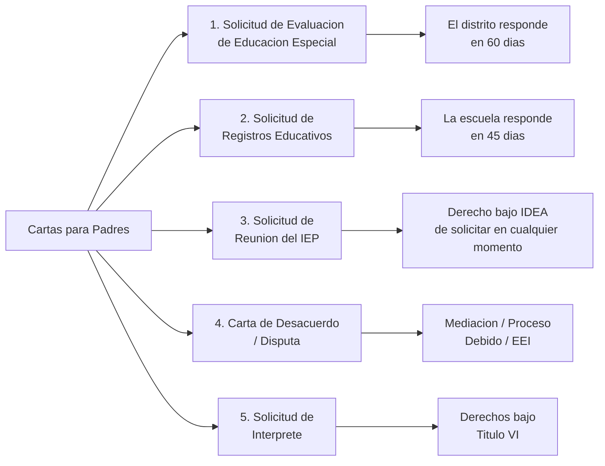
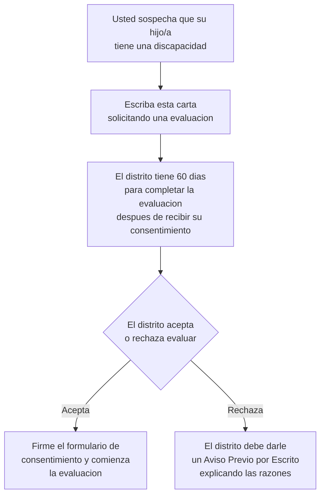
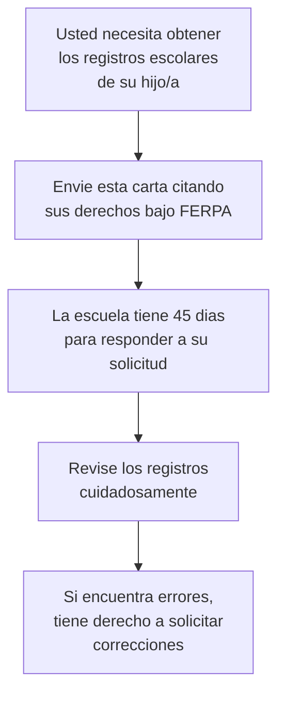
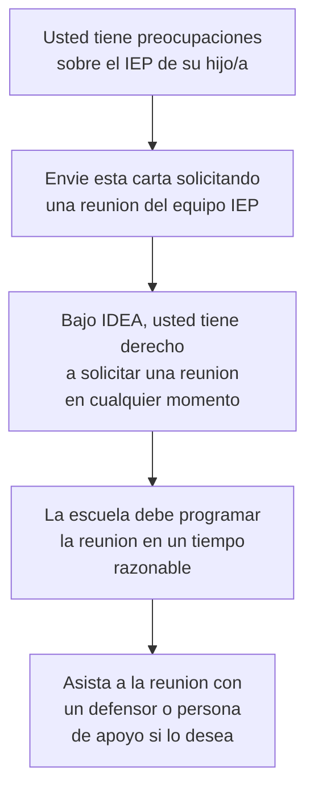
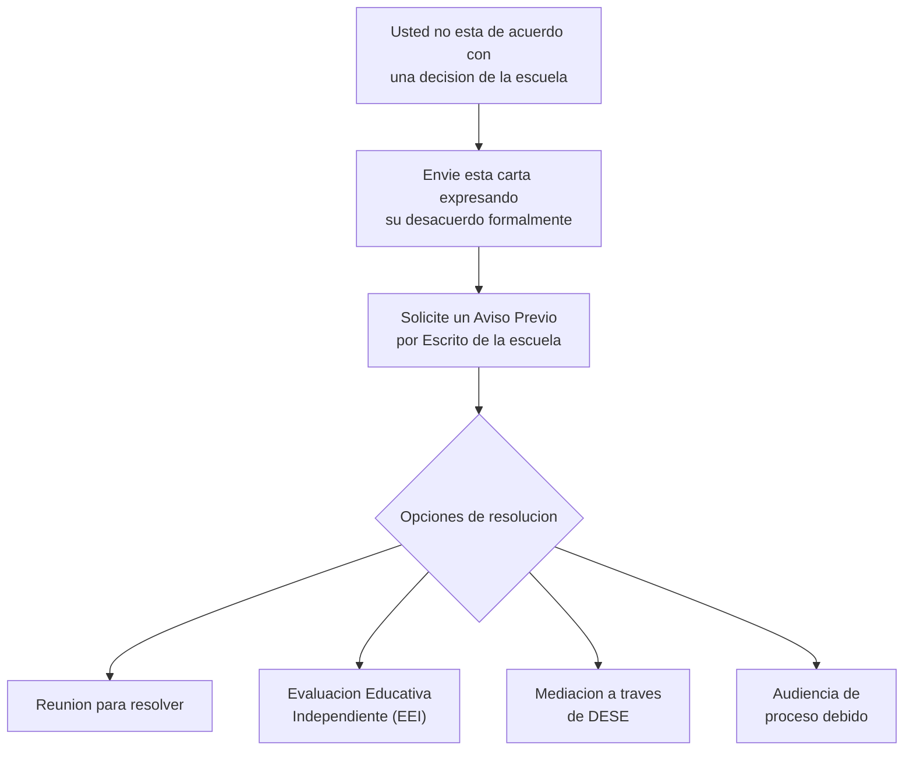
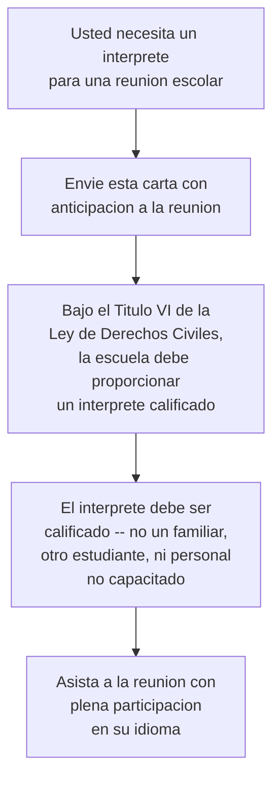

# Plantillas de Cartas para Padres (Espanol)

*Revise estas cartas con un defensor o abogado antes de enviarlas en situaciones importantes. Estas son plantillas -- personalicelas para su situacion especifica.*

## Tabla de Contenido
- [1. Solicitud de Evaluacion de Educacion Especial](#1-solicitud-de-evaluacion-de-educacion-especial)
- [2. Solicitud de Registros Educativos (FERPA)](#2-solicitud-de-registros-educativos-ferpa)
- [3. Solicitud de Reunion del IEP](#3-solicitud-de-reunion-del-iep)
- [4. Carta de Desacuerdo / Disputa](#4-carta-de-desacuerdo--disputa)
- [5. Solicitud de Interprete](#5-solicitud-de-interprete)

---

## 1. Solicitud de Evaluacion de Educacion Especial

**Para:** [NOMBRE DEL DIRECTOR/A], [NOMBRE DE LA ESCUELA]
**De:** [SU NOMBRE]
**Fecha:** [FECHA]
**Asunto:** Solicitud de Evaluacion de Educacion Especial -- [NOMBRE COMPLETO DEL NINO/A], Grado [GRADO]

Estimado/a [NOMBRE DEL DIRECTOR/A O DIRECTOR/A DE EDUCACION ESPECIAL]:

Le escribo para solicitar formalmente que el distrito escolar [NOMBRE DEL DISTRITO ESCOLAR] evalue a mi hijo/a, [NOMBRE COMPLETO DEL NINO/A], para servicios de educacion especial bajo la Ley de Educacion para Individuos con Discapacidades (IDEA, por sus siglas en ingles).

[NOMBRE DEL NINO/A] actualmente cursa el grado [GRADO] en [NOMBRE DE LA ESCUELA]. Tengo preocupaciones sobre su progreso en las siguientes areas:

- [DESCRIBA LA PREOCUPACION 1 -- por ejemplo, "lee por debajo del nivel de su grado"]
- [DESCRIBA LA PREOCUPACION 2 -- por ejemplo, "tiene dificultad para mantener la atencion y completar el trabajo"]
- [DESCRIBA LA PREOCUPACION 3 -- por ejemplo, "tiene dificultades con las interacciones sociales"]

[OPCIONAL: incluya informacion relevante -- tutoria que se ha intentado, diagnosticos medicos, preocupaciones compartidas por los maestros]

Entiendo que bajo IDEA (seccion 300.301), el distrito escolar debe responder a esta solicitud por escrito. Si el distrito acepta evaluar, la evaluacion debe completarse dentro de 60 dias calendario a partir de la fecha en que reciban mi consentimiento por escrito. Si el distrito rechaza la evaluacion, entiendo que deben proporcionarme un Aviso Previo por Escrito (Prior Written Notice) explicando las razones.

Por favor envienme los formularios de consentimiento y cualquier informacion sobre el proceso de evaluacion. Espero trabajar con el equipo escolar para apoyar a [NOMBRE DEL NINO/A].

Atentamente,
[SU NOMBRE]
[SU NUMERO DE TELEFONO]
[SU CORREO ELECTRONICO]

**Base legal:** IDEA, 34 CFR seccion 300.301 -- Solicitud de evaluacion inicial

*Nota: Guarde una copia de esta carta para sus registros.*

---

## 2. Solicitud de Registros Educativos (FERPA)

**Para:** [OFICINA DE REGISTROS DE LA ESCUELA / DISTRITO]
**De:** [SU NOMBRE]
**Fecha:** [FECHA]
**Asunto:** Solicitud de Registros Educativos -- [NOMBRE COMPLETO DEL NINO/A]

Estimado/a [NOMBRE DEL DIRECTOR/A O CUSTODIO DE REGISTROS]:

Bajo la Ley de Derechos Educativos y Privacidad de la Familia (FERPA, 20 U.S.C. seccion 1232g), solicito inspeccionar y recibir copias de todos los registros educativos de mi hijo/a:

**Nombre del estudiante:** [NOMBRE COMPLETO]
**Fecha de nacimiento:** [FECHA DE NACIMIENTO]
**Escuela:** [NOMBRE DE LA ESCUELA]
**Grado:** [GRADO]

Solicito los siguientes registros:
- [ ] Expediente acumulativo completo
- [ ] Todos los documentos y evaluaciones del IEP (si aplica)
- [ ] Todos los documentos del plan 504 (si aplica)
- [ ] Registros disciplinarios
- [ ] Registros de asistencia
- [ ] Resultados de evaluaciones/examenes (MAP, EOC, pruebas de referencia, etc.)
- [ ] Boletas de calificaciones y transcripciones
- [ ] Registros de comunicacion (notas de maestros, correos electronicos, notas de reuniones)
- [ ] Registros de salud
- [ ] Otro: [ESPECIFIQUE]

Bajo FERPA, la escuela debe responder a esta solicitud dentro de 45 dias. Solicito que las copias me sean enviadas a la direccion o correo electronico que aparece a continuacion.

Gracias,
[SU NOMBRE]
[SU DIRECCION]
[SU CORREO ELECTRONICO]
[SU NUMERO DE TELEFONO]

**Base legal:** FERPA, 20 U.S.C. seccion 1232g -- Derechos de acceso a registros educativos

*Nota: Guarde una copia de esta carta para sus registros.*

---

## 3. Solicitud de Reunion del IEP

**Para:** [COORDINADOR/A DE CASO / COORDINADOR/A DE EDUCACION ESPECIAL]
**De:** [SU NOMBRE]
**Fecha:** [FECHA]
**Asunto:** Solicitud de Reunion del IEP -- [NOMBRE COMPLETO DEL NINO/A]

Estimado/a [NOMBRE DEL COORDINADOR/A DE CASO]:

Solicito una reunion del IEP para mi hijo/a, [NOMBRE COMPLETO DEL NINO/A], para discutir lo siguiente:

- [ ] [DESCRIBA LA PREOCUPACION -- por ejemplo, "progreso hacia las metas actuales"]
- [ ] [POR EJEMPLO, "preocupaciones sobre la ubicacion actual"]
- [ ] [POR EJEMPLO, "necesidad de servicios o apoyos adicionales"]
- [ ] [POR EJEMPLO, "preocupaciones de comportamiento y posible EFC/PIC (FBA/BIP)"]
- [ ] [POR EJEMPLO, "planificacion de transicion"]

Bajo IDEA, tengo el derecho de solicitar una reunion del IEP en cualquier momento. Estoy disponible en las siguientes fechas y horarios:
- [OPCION 1]
- [OPCION 2]
- [OPCION 3]

Planeo llevar a [NOMBRE DEL DEFENSOR O PERSONA DE APOYO] a la reunion conmigo. [Opcional -- usted tiene este derecho bajo IDEA.]

**Solicitud de interprete:** [SI NECESITA UN INTERPRETE, INDIQUE: "Solicito que un interprete calificado de [IDIOMA] este presente en la reunion para asegurar mi plena participacion."]

Por favor confirme la fecha de la reunion y proporcionenme una copia del aviso de Garantias Procesales (Procedural Safeguards).

Gracias,
[SU NOMBRE]
[SU NUMERO DE TELEFONO]
[SU CORREO ELECTRONICO]

**Base legal:** IDEA, 34 CFR seccion 300.322 -- Participacion de los padres en reuniones del IEP

*Nota: Guarde una copia de esta carta para sus registros.*

---

## 4. Carta de Desacuerdo / Disputa

**Para:** [SUPERINTENDENTE / DIRECTOR/A DE EDUCACION ESPECIAL / DIRECTOR/A]
**De:** [SU NOMBRE]
**Fecha:** [FECHA]
**Asunto:** [Desacuerdo Formal / Solicitud de Resolucion] -- [NOMBRE COMPLETO DEL NINO/A]

Estimado/a [NOMBRE]:

Le escribo para expresar mi desacuerdo con [LA DECISION DE LA ESCUELA RESPECTO A / LA ACCION PROPUESTA SOBRE / LA NEGACION DE] [DESCRIBA EL ASUNTO ESPECIFICO -- por ejemplo, "la negacion de mi solicitud de evaluacion de educacion especial," "el cambio propuesto a la ubicacion del IEP de mi hijo/a," "la suspension de 10 dias emitida el (fecha)"].

**Mis preocupaciones son:**
1. [PREOCUPACION ESPECIFICA -- por ejemplo, "Los datos de la evaluacion no respaldan la determinacion de elegibilidad"]
2. [PREOCUPACION ESPECIFICA -- por ejemplo, "La ubicacion propuesta no cumple con los requisitos del Ambiente Menos Restrictivo (LRE)"]
3. [PREOCUPACION ESPECIFICA -- por ejemplo, "No se siguieron los derechos de proceso debido de mi hijo/a"]

**Solicito lo siguiente:**
- [ ] Una reunion para discutir y resolver este asunto
- [ ] Una Evaluacion Educativa Independiente (EEI) a costo del distrito
- [ ] Mediacion a traves del Departamento de Educacion Primaria y Secundaria de Missouri (DESE)
- [ ] Una audiencia formal de proceso debido
- [ ] Una audiencia formal respecto a la suspension/expulsion propuesta (RSMo 167.171)
- [ ] Otro: [ESPECIFIQUE]

Solicito que el distrito me proporcione un Aviso Previo por Escrito (Prior Written Notice) detallando la decision tomada, las razones de la decision, y las opciones consideradas y rechazadas.

Entiendo mis derechos bajo [IDEA / Seccion 504 / RSMo 167.161-171 / otra ley aplicable] y las garantias procesales correspondientes. Estoy preparado/a para buscar la resolucion de disputas apropiada si no podemos resolver este asunto de manera colaborativa.

Espero su respuesta dentro de [10 DIAS HABILES / UN PLAZO RAZONABLE].

Atentamente,
[SU NOMBRE]
[SU NUMERO DE TELEFONO]
[SU CORREO ELECTRONICO]

*CC: [Su defensor/abogado, si aplica]*

**Base legal:** IDEA, 34 CFR secciones 300.503 (Aviso Previo por Escrito), 300.506 (Mediacion), 300.507 (Proceso debido); Seccion 504 de la Ley de Rehabilitacion de 1973

*Nota: Guarde una copia de esta carta para sus registros.*

---

## 5. Solicitud de Interprete

**Para:** [NOMBRE DEL DIRECTOR/A O ADMINISTRADOR/A ESCOLAR]
**De:** [SU NOMBRE]
**Fecha:** [FECHA]
**Asunto:** Solicitud de Interprete para Reunion Escolar -- [NOMBRE COMPLETO DEL NINO/A]

Estimado/a [NOMBRE DEL DIRECTOR/A O ADMINISTRADOR/A]:

Le escribo para solicitar formalmente que la escuela proporcione un interprete calificado de [IDIOMA NECESARIO -- por ejemplo, "espanol"] para la siguiente reunion escolar:

**Tipo de reunion:** [TIPO DE REUNION -- por ejemplo, "reunion del IEP," "conferencia de padres y maestros," "reunion disciplinaria," "reunion del plan 504," "audiencia de expulsion"]
**Fecha de la reunion:** [FECHA DE LA REUNION]
**Hora de la reunion:** [HORA DE LA REUNION]
**Estudiante:** [NOMBRE COMPLETO DEL NINO/A], Grado [GRADO]

Mi idioma principal es [SU IDIOMA PRINCIPAL] y necesito un interprete calificado para poder participar plenamente en esta reunion y comprender toda la informacion que se discuta sobre la educacion de mi hijo/a.

Bajo el Titulo VI de la Ley de Derechos Civiles de 1964 y la orientacion del Departamento de Educacion de los Estados Unidos, las escuelas que reciben fondos federales tienen la obligacion de proporcionar servicios de interpretacion a padres con dominio limitado del ingles (LEP). El interprete debe ser una persona calificada -- no un menor de edad, no otro estudiante, ni un miembro de la familia, a menos que yo lo solicite especificamente.

Tambien solicito que todos los documentos importantes relacionados con esta reunion sean proporcionados traducidos a [IDIOMA NECESARIO], o que el interprete traduzca los documentos durante la reunion.

Agradezco su atencion a esta solicitud. Por favor confirme que un interprete estara disponible para la reunion.

Gracias,
[SU NOMBRE]
[SU DIRECCION]
[SU NUMERO DE TELEFONO]
[SU CORREO ELECTRONICO]

**Base legal:** Titulo VI de la Ley de Derechos Civiles de 1964, 42 U.S.C. seccion 2000d; Orden Ejecutiva 13166; Orientacion del Departamento de Educacion de EE.UU. sobre acceso linguistico

*Nota: Guarde una copia de esta carta para sus registros.*
