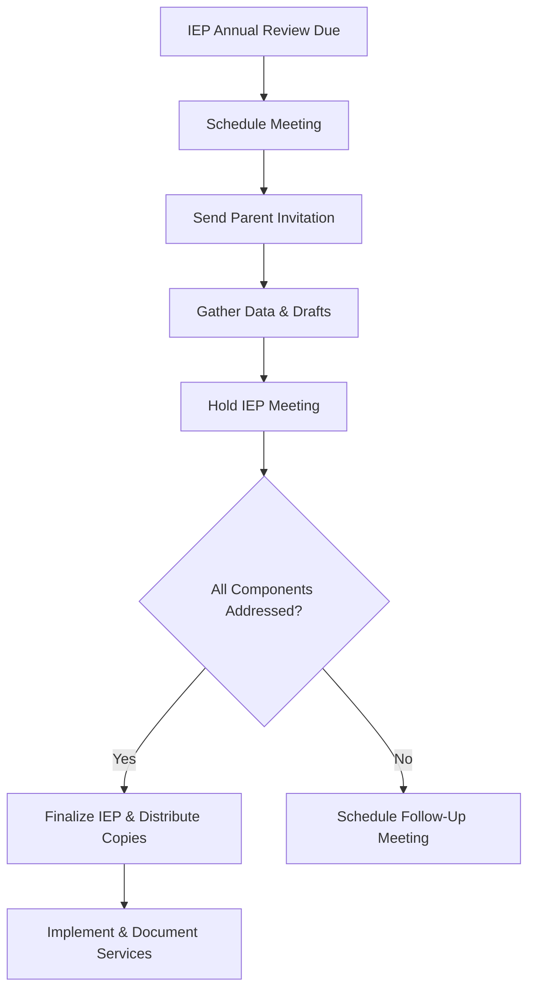
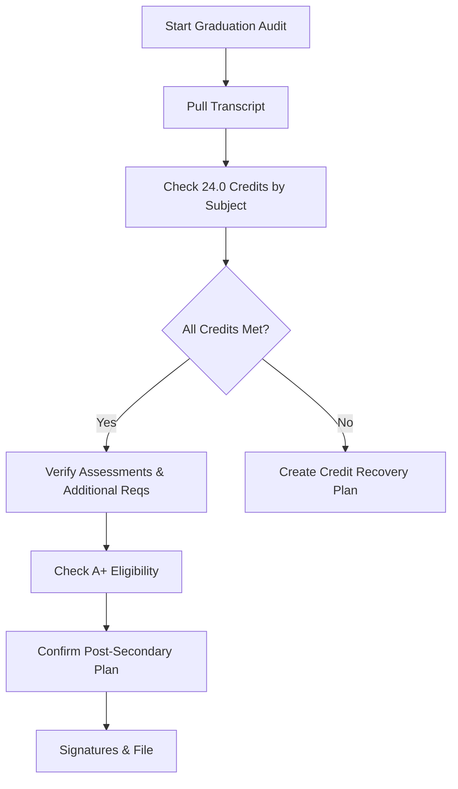
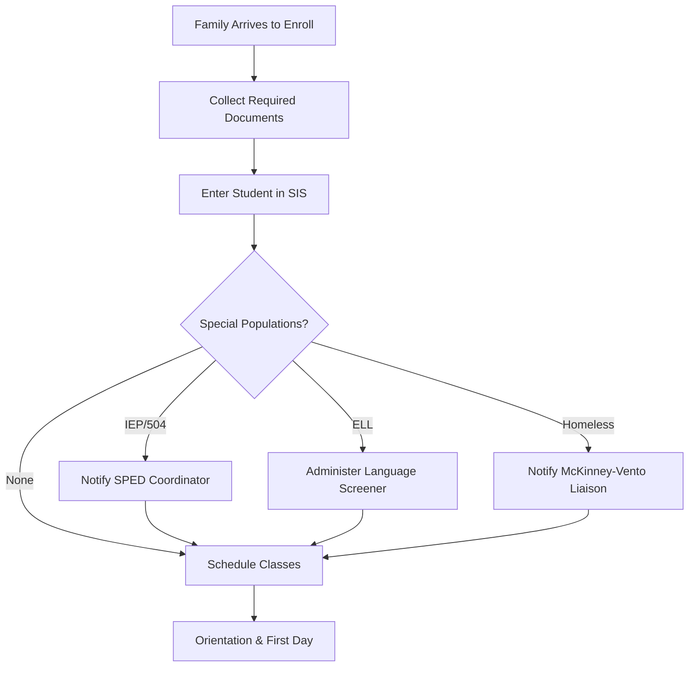
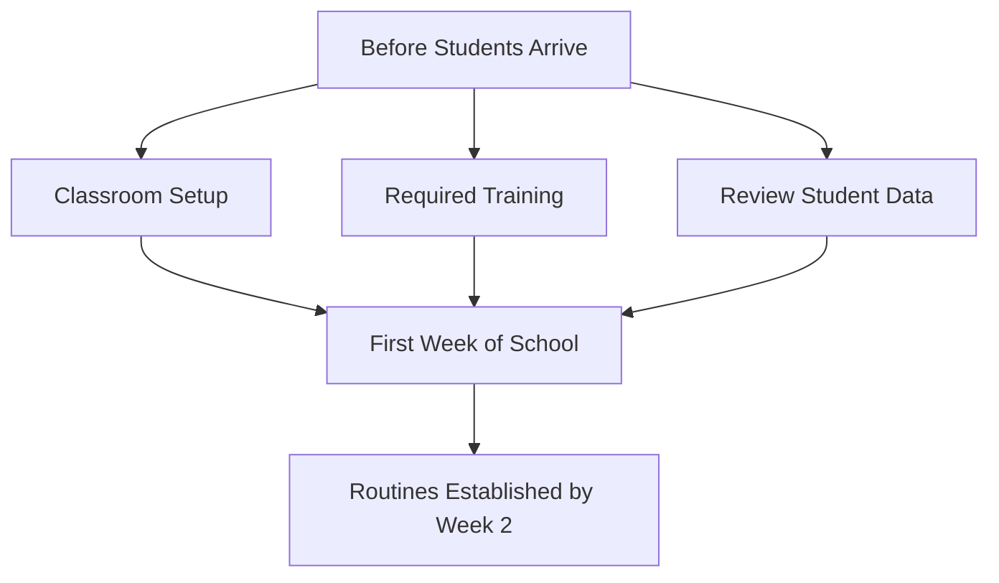
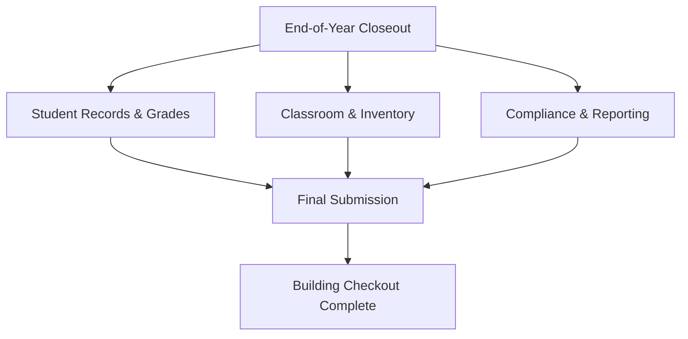
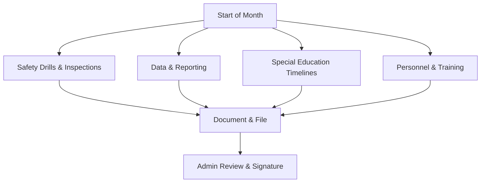
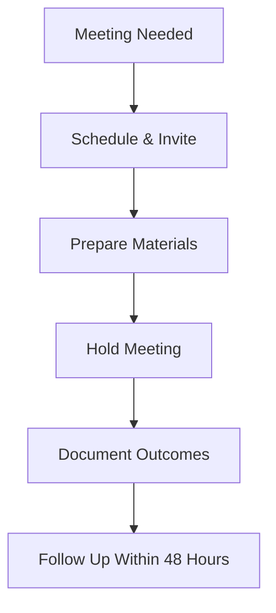
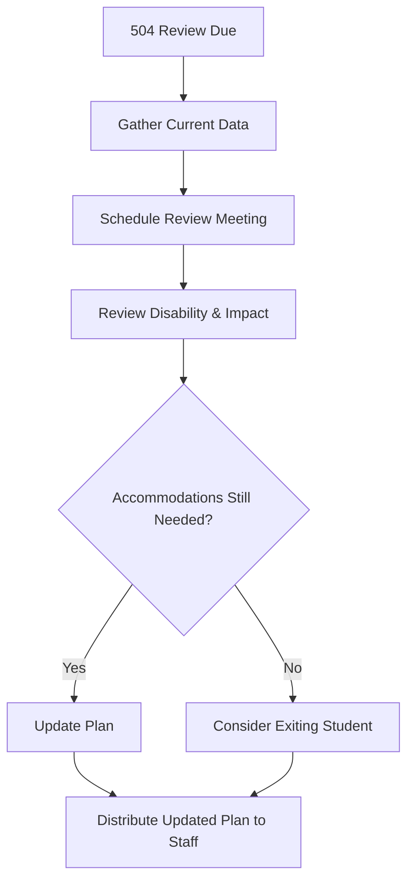
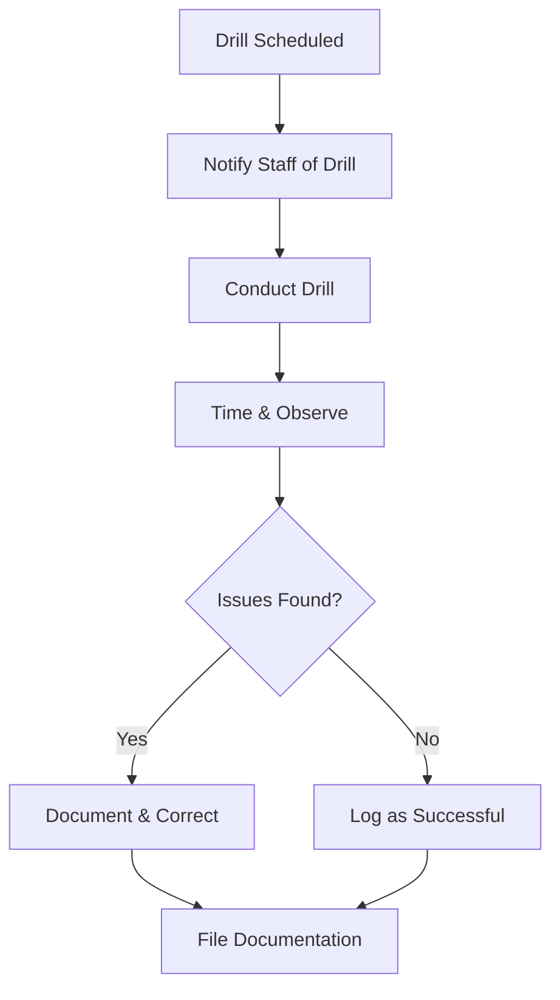
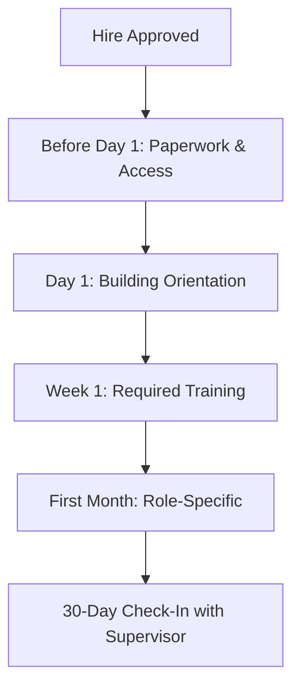

# Printable Checklists -- Missouri K-12 Education

> **Print tip:** Use your browser's or editor's print function. Each checklist is separated by a page-break hint (`

`). Print in portrait, margins 0.5 in.

---

## 1. IEP Annual Review Checklist

**Student:** ___________________________ **Grade:** _____ **Date:** _______________
**Case Manager:** ___________________________ **School:** ___________________________

### Pre-Meeting
- [ ] Confirm annual review date is within 365 days of last IEP
- [ ] Send written meeting invitation to parent/guardian (10+ calendar days ahead)
- [ ] Invite all required team members (parent, gen ed teacher, sped teacher, LEA rep, evaluation interpreter)
- [ ] Obtain written excusal if any required member cannot attend
- [ ] Collect progress data on all current IEP goals
- [ ] Request teacher input on academic and functional performance
- [ ] Review current evaluation data; determine if triennial reevaluation is due

### During Meeting
- [ ] Provide procedural safeguards to parent
- [ ] Review and update Present Levels (PLAAFP) -- academic and functional
- [ ] Develop measurable annual goals (with baselines and criteria)
- [ ] Determine special education services, related services, and supplementary aids
- [ ] Specify frequency, location, and duration for each service
- [ ] Document LRE justification (time outside general education)
- [ ] Address ESY consideration and document decision
- [ ] Address assistive technology consideration and document decision
- [ ] Address behavior needs; determine if FBA/BIP is needed
- [ ] Complete transition plan if student is 16 or older

### Post-Meeting
- [ ] Issue Prior Written Notice (PWN) for all proposed/refused actions
- [ ] Provide copy of finalized IEP to parent
- [ ] Distribute IEP-at-a-glance to all service providers and teachers
- [ ] Update SIS/IEP system with new dates and services
- [ ] Begin service delivery per new IEP on the start date

> **Source:** `templates/specialist/iep-compliance-checklist.md`

---

## 2. Graduation Credit Audit Checklist

**Student:** ___________________________ **Expected Graduation:** _______________
**Counselor:** ___________________________ **Audit Date:** _______________

### Credit Requirements (24.0 Minimum -- verify district policy)
- [ ] English Language Arts -- 4.0 credits
- [ ] Mathematics (including Algebra I or higher) -- 3.0 credits
- [ ] Science (including 1 lab science) -- 3.0 credits
- [ ] Social Studies (Am. History, Am. Gov., World History) -- 3.0 credits
- [ ] Fine Arts -- 1.0 credit
- [ ] Practical Arts -- 1.0 credit
- [ ] Physical Education -- 1.0 credit
- [ ] Health -- 0.5 credit
- [ ] Personal Finance (RSMo 170.013) -- 0.5 credit
- [ ] Electives -- 7.0 credits
- [ ] Total credits earned or in progress meet 24.0 minimum

### Assessment Participation
- [ ] EOC -- English II (participated)
- [ ] EOC -- Algebra I (participated)
- [ ] EOC -- Biology (participated)
- [ ] EOC -- American Government (participated)
- [ ] ACT taken (Grade 11 statewide administration)

### Additional Requirements
- [ ] CPR instruction completed (RSMo 170.310)
- [ ] U.S. and Missouri Constitution requirement met
- [ ] District-specific additional requirements met (if any)

### A+ Program Eligibility (if applicable)
- [ ] Attended an A+ designated school for 3 consecutive years
- [ ] Cumulative GPA is 2.5 or higher
- [ ] Cumulative attendance is 95% or higher
- [ ] 50 hours of tutoring/mentoring completed
- [ ] Good citizenship maintained
- [ ] FAFSA completed (or waiver obtained)
- [ ] Algebra I EOC -- proficient or advanced

> **Source:** `templates/counselor/graduation-audit.md`

---

## 3. New Student Enrollment Checklist

**Student:** ___________________________ **Grade:** _____ **Date:** _______________
**Enrolling School:** ___________________________ **Registrar:** ___________________________

### Required Documents
- [ ] Proof of residency (utility bill, lease, or affidavit)
- [ ] Birth certificate or equivalent proof of age
- [ ] Immunization records (RSMo 167.181) -- or exemption on file
- [ ] Previous school records requested (transcript, IEP, 504, discipline)
- [ ] Completed enrollment forms (emergency contacts, medical info, media release)
- [ ] Free/reduced meal application provided to family

### System Entry
- [ ] Student entered into SIS with correct demographics
- [ ] Home Language Survey completed
- [ ] If home language is not English, refer for ELL screening (WIDA Screener)
- [ ] Check for existing IEP or 504 plan -- notify special education coordinator
- [ ] Screen for McKinney-Vento (homeless) eligibility
- [ ] Assign student to grade level and course schedule
- [ ] Issue student ID and technology accounts

### Orientation
- [ ] Building tour provided (or buddy assigned)
- [ ] Student handbook and code of conduct provided
- [ ] Locker/supplies assigned
- [ ] Introduce to counselor, teachers, and office staff
- [ ] Provide transportation information (bus route, pickup time)
- [ ] Parent/guardian receives school communication information (app, portal, email)

> **Sources:** `references/compliance/compliance-calendar.md` (enrollment procedures), `templates/staff/checklists.md`

---

## 4. Beginning-of-Year Teacher Checklist

**Teacher:** ___________________________ **School:** ___________________________
**Grade/Subject:** ___________________________ **Year:** _______________

### Before Students Arrive
- [ ] Complete mandated reporter training (RSMo 210.115)
- [ ] Complete bloodborne pathogens training (OSHA)
- [ ] Review FERPA student confidentiality requirements
- [ ] Review building emergency procedures (fire, tornado, lockdown, earthquake)
- [ ] Attend building and district professional development sessions
- [ ] Set up classroom (seating, materials, bulletin boards, technology)
- [ ] Test all technology (projector, computer, LMS access, student devices)
- [ ] Review roster and student records (IEPs, 504 plans, health alerts, ELL status)

### First Week
- [ ] Post and teach classroom rules, expectations, and procedures
- [ ] Practice emergency drill procedures with students
- [ ] Distribute and review student/parent handbook or syllabus
- [ ] Communicate with parents (intro letter, email, or app message)
- [ ] Verify IEP and 504 accommodations are in place for all identified students
- [ ] Administer beginning-of-year assessments or diagnostics (if applicable)
- [ ] Confirm PLC/team meeting schedule
- [ ] Set up gradebook with correct categories and weights

### First Month
- [ ] Complete MEES pre-observation conference (if non-tenured)
- [ ] Submit emergency sub plan to office
- [ ] Establish parent communication routine (weekly update, newsletter, etc.)
- [ ] Identify students who may need intervention referrals (academic or behavioral)
- [ ] Attend IEP or 504 meetings as scheduled for your students

> **Sources:** `templates/staff/checklists.md`, `references/compliance/compliance-calendar.md`

---

## 5. End-of-Year Closeout Checklist

**Teacher/Staff:** ___________________________ **School:** ___________________________
**Position:** ___________________________ **Date:** _______________

### Student Records
- [ ] Final grades entered and verified in SIS
- [ ] Missing assignments and incompletes resolved
- [ ] Report cards generated and distributed
- [ ] Cumulative folders updated with current year data
- [ ] Retention/promotion decisions documented
- [ ] IEP progress reports completed and sent to parents
- [ ] Transition paperwork completed for students moving to next level

### Assessments and Data
- [ ] All MAP/EOC testing materials returned and accounted for
- [ ] End-of-year MOSIS data reviewed for accuracy (attendance, discipline, grades)
- [ ] A+ eligibility verification completed for graduating seniors

### Classroom and Inventory
- [ ] Textbooks collected and inventory reconciled
- [ ] Technology devices collected, checked in, and stored
- [ ] Classroom cleaned and furniture arranged per building protocol
- [ ] Personal items removed from classroom
- [ ] Keys, ID badge, and access cards returned (if leaving position)
- [ ] Supply requests submitted for next year

### Administrative
- [ ] MEES end-of-year evaluation conference completed (if applicable)
- [ ] Professional development hours logged and documentation submitted
- [ ] Leave balances verified
- [ ] Summer contact information provided to office
- [ ] Building checkout form signed by supervisor

> **Sources:** `references/compliance/compliance-calendar.md` (May/June), `templates/admin/operational-forms.md`

---

## 6. Monthly Compliance Checklist (Generic)

**Building:** ___________________________ **Month:** _______________ **Year:** _______
**Completed by:** ___________________________ **Date:** _______________

### Safety (Every Month)
- [ ] Fire drill conducted and documented (date, time, evacuation time)
- [ ] AED inspected and functional
- [ ] First aid kits inspected and restocked as needed
- [ ] Building safety concern walk-through completed
- [ ] Emergency contact lists updated for any new students or staff

### Special Education
- [ ] IEP annual reviews due this month identified and scheduled
- [ ] Triennial reevaluations due this month identified and scheduled
- [ ] Evaluation timelines tracked (60-day consent clock)
- [ ] Related services delivered per IEP (service logs current)
- [ ] Any discipline removals tracked (monitor 10-day cumulative threshold)

### Data and Records
- [ ] Attendance data reviewed for accuracy
- [ ] Chronic absence students identified (below 90% attendance)
- [ ] Discipline data entered and current
- [ ] DESE reporting deadlines for this month identified and addressed
- [ ] Board meeting materials prepared (if board meets this month)

### Personnel
- [ ] New hire paperwork and background checks completed for any new staff
- [ ] Substitute teacher credentials verified for any new subs
- [ ] Required training tracked (any overdue completions flagged)

### Communications
- [ ] Parent communication sent (newsletter, update, or notification)
- [ ] Community posting requirements met (board agenda, notices)

> **Source:** `references/compliance/compliance-calendar.md`

---

## 7. Parent Meeting Preparation Checklist

**Student:** ___________________________ **Meeting Date:** _______________
**Meeting Type:** ☐ IEP ☐ 504 ☐ Discipline ☐ Academic ☐ Other: _______________
**Organizer:** ___________________________ **Location:** ___________________________

### Scheduling
- [ ] Date and time set with parent availability in mind
- [ ] Written invitation sent (include purpose, date, time, location, attendees)
- [ ] Interpreter arranged if family speaks a language other than English
- [ ] Virtual/phone option offered if parent cannot attend in person
- [ ] All required team members confirmed (for IEP: parent, gen ed, sped, LEA rep)
- [ ] Childcare or transportation need identified and addressed (if possible)

### Preparation
- [ ] Agenda prepared and shared with team in advance
- [ ] Student data compiled (grades, attendance, behavior, assessment scores)
- [ ] Work samples or progress monitoring data gathered
- [ ] Draft documents prepared (IEP draft, 504 plan, behavior plan, etc.)
- [ ] Procedural safeguards copy ready (for IEP/504 meetings)
- [ ] Previous meeting notes reviewed
- [ ] Room reserved and set up (copies, tissues, water, seating arrangement)

### During Meeting
- [ ] Welcome parent and make introductions
- [ ] State purpose of meeting and review agenda
- [ ] Ask parent for their input and observations first
- [ ] Present data clearly and without jargon
- [ ] Document all decisions, agreements, and action items
- [ ] Ensure parent understands their rights (especially for IEP/504/discipline)

### After Meeting
- [ ] Provide parent with copies of all documents (IEP, PWN, 504, notes)
- [ ] Send Prior Written Notice if required (IEP/504 decisions)
- [ ] Enter action items with owners and deadlines
- [ ] Follow up with parent within 48 hours (thank them, confirm next steps)

> **Sources:** `templates/specialist/iep-compliance-checklist.md`, `templates/admin/operational-forms.md`

---

## 8. 504 Plan Review Checklist

**Student:** ___________________________ **Grade:** _____ **Date:** _______________
**504 Coordinator:** ___________________________ **School:** ___________________________

### Pre-Review
- [ ] Confirm annual review is scheduled (504 plans reviewed at least annually)
- [ ] Notify parent/guardian of meeting date and invite to participate
- [ ] Collect current medical documentation or physician input (if needed)
- [ ] Gather teacher feedback on effectiveness of current accommodations
- [ ] Pull current grades, attendance, and discipline data
- [ ] Review previous 504 plan and any evaluation data

### During Review Meeting
- [ ] Confirm student still has a qualifying disability under Section 504
- [ ] Review how the disability substantially limits a major life activity
- [ ] Evaluate whether current accommodations are effective
- [ ] Adjust, add, or remove accommodations as needed
- [ ] Discuss assessment accommodations (MAP, EOC, ACT, classroom tests)
- [ ] Document any behavior or discipline considerations
- [ ] Address transportation, physical access, or health needs
- [ ] Discuss transition needs for students changing buildings

### Post-Review
- [ ] Finalize updated 504 plan with all accommodations listed
- [ ] Provide copy of plan to parent/guardian
- [ ] Distribute accommodation list to all teachers and relevant staff
- [ ] Update SIS with current 504 status and accommodations
- [ ] File documentation in student's 504 folder
- [ ] Set reminder for next annual review date
- [ ] Notify parent of right to due process if they disagree with decisions

> **Sources:** `references/compliance/compliance-calendar.md` (Section 504), `templates/specialist/iep-compliance-checklist.md` (adapted)

---

## 9. Emergency Drill Documentation Checklist

**School:** ___________________________ **Drill Date:** _______________
**Drill Type:** ☐ Fire ☐ Tornado ☐ Earthquake ☐ Lockdown ☐ Bus Evacuation
**Conducted by:** ___________________________ **Time Started:** _______ **Time Cleared:** _______

### Pre-Drill
- [ ] Drill type selected per schedule (fire: monthly; tornado: 2x/year; earthquake: 2x/year; lockdown: 2x/year)
- [ ] Staff notified of drill (or unannounced, per admin decision)
- [ ] Observers assigned to monitor hallways, exits, and assembly areas
- [ ] Accommodation plan confirmed for students with mobility or sensory needs
- [ ] Visitor and volunteer procedures reviewed

### During Drill
- [ ] Alarm or announcement activated at designated time
- [ ] All classrooms evacuated or secured (per drill type)
- [ ] Teachers took attendance at assembly point or in secured location
- [ ] Office confirmed all students and staff accounted for
- [ ] Evacuation routes were clear and accessible
- [ ] Students with disabilities assisted per their individual plans
- [ ] Communication systems functioned (PA, radios, phones)

### Post-Drill
- [ ] Total evacuation/response time recorded: _______ minutes _______ seconds
- [ ] Debrief conducted with staff (issues, bottlenecks, successes)
- [ ] Any problems documented (blocked exits, confusion, slow response, missing students)
- [ ] Corrective actions assigned with responsible party and deadline
- [ ] Drill log completed and filed with building safety plan
- [ ] Report submitted to district office (if required by district policy)
- [ ] Next drill date scheduled

### Annual Drill Requirements (Missouri)
- [ ] Fire drills: minimum 1 per month school is in session
- [ ] Tornado drills: minimum 2 per year
- [ ] Earthquake drills: minimum 2 per year
- [ ] Lockdown/intruder drills: minimum 2 per year (recommended)
- [ ] Bus evacuation drill: minimum 1 per year

> **Source:** `references/compliance/compliance-calendar.md` (Safety & Health Compliance)

---

## 10. New Employee Onboarding Checklist

**Employee:** ___________________________ **Position:** ___________________________
**School/Building:** ___________________________ **Start Date:** _______________
**Supervisor:** ___________________________ **HR Contact:** ___________________________

### Before First Day
- [ ] Background check cleared (RSMo 168.133) -- must clear before start date
- [ ] Employment paperwork completed (I-9, W-4, benefits enrollment, direct deposit)
- [ ] Photo ID badge issued
- [ ] Building keys and/or access card issued
- [ ] Technology accounts created (email, SIS, LMS, phone system)
- [ ] Parking assignment provided (if applicable)
- [ ] Employee handbook provided

### Day 1 -- Building Orientation
- [ ] Building tour (classrooms, office, nurse, cafeteria, gym, exits, staff lounge)
- [ ] Introduced to principal, office staff, custodian, nurse
- [ ] Emergency procedures reviewed (fire exits, tornado shelter, lockdown, AED location)
- [ ] Communication systems explained (PA, radios, phone, email, emergency notification)
- [ ] Daily schedule and bell times provided
- [ ] Absence/leave reporting procedure explained
- [ ] Supply locations identified

### Week 1 -- Required Training
- [ ] Mandated reporter training completed (RSMo 210.115)
- [ ] Bloodborne pathogens training completed (OSHA)
- [ ] FERPA / student confidentiality overview completed
- [ ] Building emergency procedures and assigned role reviewed
- [ ] District Acceptable Use Policy (AUP) signed
- [ ] Anti-harassment / Title IX overview completed
- [ ] District discipline code overview provided

### First Month -- Role-Specific
- [ ] Mentor assigned (RSMo 168.028 for certified staff)
- [ ] Curriculum, standards, or role-specific procedures reviewed
- [ ] IEP/504 student accommodations reviewed with special education team
- [ ] PLC or team assignment and meeting schedule confirmed
- [ ] If classified: role-specific certifications verified (CDL, food handler, ESSA para, etc.)
- [ ] 30-day check-in meeting with supervisor completed

### Signatures
| Item | Employee Signature | Date |
|------|-------------------|------|
| Handbook received | | |
| Emergency procedures reviewed | | |
| Mandated reporter training completed | | |
| AUP signed | | |
| Background check confirmation | | |

> **Source:** `templates/staff/checklists.md`
