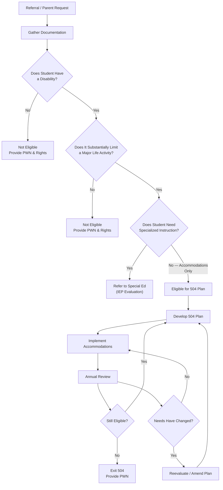
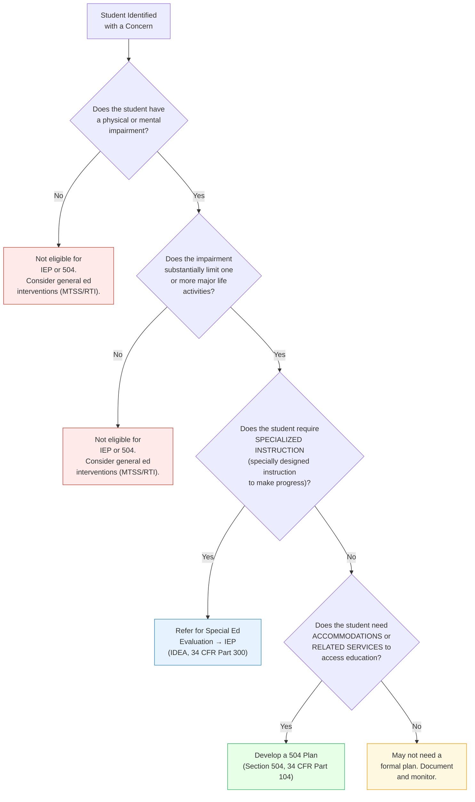
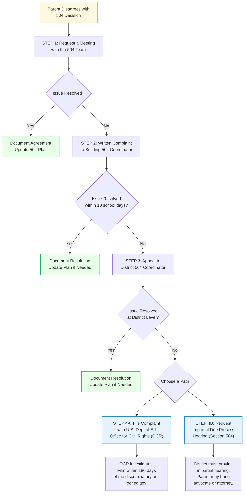

# 504 Process Decision Trees & Templates

## Table of Contents

- [1. IEP vs. 504 Decision Tree](#1-iep-vs-504-decision-tree)
- [2. 504 Eligibility Determination Template](#2-504-eligibility-determination-template)
- [3. 504 Plan Template](#3-504-plan-template)
- [4. 504 Meeting Agenda Template](#4-504-meeting-agenda-template)
- [5. Annual Review Checklist](#5-annual-review-checklist)
- [6. Dispute Resolution Decision Tree](#6-dispute-resolution-decision-tree)
- [7. Related Resources](#7-related-resources)

---

## 1. IEP vs. 504 Decision Tree

Use this flowchart to determine whether a student should be served under IDEA (IEP) or Section 504 (accommodation plan).

### Common Examples by Condition

| Condition | Typical Path | Reasoning |
|-----------|-------------|-----------|
| **Type 1 Diabetes** | 504 Plan | Substantially limits eating, caring for oneself; needs accommodations (nurse access, snack breaks, blood sugar monitoring) but not specialized instruction |
| **Specific Learning Disability (Dyslexia)** | Usually IEP | Substantially limits reading/learning; typically requires specialized instruction (structured literacy, multisensory methods) |
| **ADHD** | Could be either | If substantially limits concentrating/learning: 504 if only accommodations needed (preferential seating, breaks, extended time); IEP if specialized instruction needed for academic impact |
| **Anxiety Disorder** | 504 Plan | Substantially limits thinking/concentrating; typically addressed through accommodations (breaks, testing modifications, counselor check-ins) |
| **Asthma** | 504 Plan | Substantially limits breathing; needs health accommodations (inhaler access, activity modifications, emergency plan) |
| **Autism Spectrum Disorder** | Usually IEP | Often requires specialized instruction for communication, social skills, academics; may need related services (speech, OT) |
| **Seizure Disorder / Epilepsy** | 504 Plan | Substantially limits neurological functions; needs health/safety accommodations (emergency plan, nurse access, rest after seizure) |
| **Broken leg (temporary)** | Typically neither | May not be a disability under 504 if expected to heal fully; district may provide temporary accommodations informally |
| **Vision impairment (corrected by glasses)** | Typically neither | Mitigating measures (glasses) considered only if impairment still substantially limits with correction under ADA Amendments Act |

> **Key distinction:** IEP = student needs *specially designed instruction* to make progress. 504 = student needs *accommodations or modifications* to access the same education as peers, but not specialized instruction.

> **Missouri note:** Under RSMo 162.675-162.695 and DESE guidance, school districts must have a 504 coordinator and written procedures. There is no state funding tied to 504 plans (unlike IEP, which generates state/federal special education funds).

---

## 2. 504 Eligibility Determination Template

**Student:** ___________________________ **DOB:** _____________ **Grade:** _____
**School:** ___________________________ **District:** ___________________________
**504 Coordinator:** ___________________________ **Date of Meeting:** _____________
**Parent/Guardian:** ___________________________

---

### Referral Information

**Referred by:** ☐ Parent ☐ Teacher ☐ Counselor ☐ Administrator ☐ Student (self) ☐ Other: ___
**Date of referral:** _____________
**Reason for referral:** _______________________________________________________________________________

### Disability / Impairment Identification

**Identified physical or mental impairment:** _______________________________________________
**Diagnosed by:** ___________________________ **Date of diagnosis:** _____________
**Medical/clinical documentation on file:** ☐ Yes ☐ No ☐ Requested (date: _______)

### Major Life Activity Affected

Check all that apply:

☐ Learning ☐ Reading ☐ Writing ☐ Thinking ☐ Concentrating
☐ Communicating ☐ Speaking ☐ Listening ☐ Breathing ☐ Eating
☐ Sleeping ☐ Walking ☐ Standing ☐ Bending ☐ Lifting
☐ Seeing ☐ Hearing ☐ Caring for oneself ☐ Performing manual tasks
☐ Working ☐ Major bodily function (specify: ___________________________)
☐ Other: ___________________________

### Substantial Limitation Analysis

**How does the impairment limit the identified major life activity compared to most students of the same age?**
_______________________________________________________________________________
_______________________________________________________________________________

**Duration:** ☐ Permanent/Chronic ☐ Expected to last > 6 months ☐ Episodic (substantially limiting when active)

### Evidence Reviewed

| Source | Date | Reviewed? | Key Findings |
|--------|------|-----------|-------------|
| Medical records / diagnosis | | ☐ | |
| Teacher observations / input | | ☐ | |
| Parent input | | ☐ | |
| Grades / academic records | | ☐ | |
| Attendance records | | ☐ | |
| Standardized test scores (MAP/EOC) | | ☐ | |
| Discipline records | | ☐ | |
| Previous evaluations (psychoeducational, etc.) | | ☐ | |
| Classroom work samples | | ☐ | |
| Outside agency reports | | ☐ | |
| Other: ___________________________ | | ☐ | |

### Eligibility Determination

**The 504 team has determined:**

☐ **ELIGIBLE** — The student has a physical or mental impairment that substantially limits one or more major life activities and requires accommodations to access education.

☐ **NOT ELIGIBLE** — The student:
  ☐ Does not have an identified physical or mental impairment
  ☐ Has an impairment that does not substantially limit a major life activity
  ☐ Does not require accommodations to access education
  ☐ Other: ___________________________

☐ **REFERRED TO SPECIAL EDUCATION** — The student may require specialized instruction; referral for IDEA evaluation initiated.

### 504 Team Members

| Name | Role | Signature | Date |
|------|------|-----------|------|
| | Parent/Guardian | | |
| | 504 Coordinator | | |
| | General Ed Teacher | | |
| | Counselor | | |
| | Administrator | | |
| | Other: ___ | | |

**Prior Written Notice (PWN) provided to parent:** ☐ Yes — Date: _____________
**Procedural safeguards / parent rights provided:** ☐ Yes — Date: _____________

---

## 3. 504 Plan Template

**Student:** ___________________________ **DOB:** _____________ **Grade:** _____
**School:** ___________________________ **504 Coordinator:** ___________________________
**Date of Plan:** _____________ **Annual Review Date:** _____________
**Disability / Condition:** ___________________________
**Major Life Activity Affected:** ___________________________

---

### Testing Accommodations

| # | Accommodation | Classroom Tests | District Assessments | State (MAP/EOC) |
|---|--------------|:-:|:-:|:-:|
| 1 | Extended time (1.5x / 2x / ___) | ☐ | ☐ | ☐ |
| 2 | Separate / reduced-distraction setting | ☐ | ☐ | ☐ |
| 3 | Read-aloud (human reader or text-to-speech) | ☐ | ☐ | ☐ |
| 4 | Scribe or speech-to-text | ☐ | ☐ | ☐ |
| 5 | Frequent breaks during testing | ☐ | ☐ | ☐ |
| 6 | Large print or magnification | ☐ | ☐ | ☐ |
| 7 | Calculator permitted | ☐ | ☐ | ☐ |
| 8 | Other: ___________________________ | ☐ | ☐ | ☐ |

> **Note:** State assessment (MAP/EOC) accommodations must be consistent with DESE-approved accommodation options. See the current year's *Test Coordinator's Manual* for allowable accommodations.

### Classroom Accommodations

| # | Accommodation | Setting | Responsible Staff |
|---|--------------|---------|------------------|
| 1 | Preferential seating (specify: front, near door, away from distractions) | ☐ All ☐ Specific: ___ | |
| 2 | Movement breaks (frequency: ___) | ☐ All ☐ Specific: ___ | |
| 3 | Fidget tools or sensory supports | ☐ All ☐ Specific: ___ | |
| 4 | Reduced/modified homework assignments | ☐ All ☐ Specific: ___ | |
| 5 | Copy of teacher notes or guided notes | ☐ All ☐ Specific: ___ | |
| 6 | Extended time on assignments (1.5x / 2x / ___) | ☐ All ☐ Specific: ___ | |
| 7 | Assistive technology (specify: ___) | ☐ All ☐ Specific: ___ | |
| 8 | Audio recordings of lectures | ☐ All ☐ Specific: ___ | |
| 9 | Graphic organizers / visual supports | ☐ All ☐ Specific: ___ | |
| 10 | Reduced visual clutter on worksheets | ☐ All ☐ Specific: ___ | |
| 11 | Other: ___________________________ | ☐ All ☐ Specific: ___ | |

### Health Accommodations

| # | Accommodation | Details | Responsible Staff |
|---|--------------|---------|------------------|
| 1 | Access to medication during school day | Medication: ___ Schedule: ___ | |
| 2 | Unlimited nurse / health office access | Condition: ___ | |
| 3 | Emergency action plan on file | Plan dated: ___ Location: ___ | |
| 4 | Water bottle permitted in class | | |
| 5 | Snack breaks as needed | Condition: ___ Frequency: ___ | |
| 6 | Elevator / accessibility access | | |
| 7 | Modified PE / physical activity | Restrictions: ___ | |
| 8 | Other: ___________________________ | | |

☐ Individualized Healthcare Plan (IHP) attached
☐ Emergency Action Plan attached
☐ School nurse has been notified — Date: _____________

### Behavioral Accommodations

| # | Accommodation | Setting | Responsible Staff |
|---|--------------|---------|------------------|
| 1 | Regular check-ins with counselor / designated adult (frequency: ___) | | |
| 2 | Modified behavioral expectations (specify: ___) | | |
| 3 | Advance notice of schedule changes or transitions | | |
| 4 | Safe space / cool-down area access | Location: ___ | |
| 5 | Positive reinforcement plan (specify: ___) | | |
| 6 | Modified discipline consequences (per 504 protections) | | |
| 7 | Reduced passing time or early release from class | | |
| 8 | Other: ___________________________ | | |

### Plan Distribution

☐ Parent copy provided — Date: _______________
☐ Filed in student record
☐ All teachers notified and provided copy — Date: _______________
☐ Substitute teacher folder updated
☐ School nurse notified
☐ Counselor notified
☐ Front office notified (for health/safety accommodations)
☐ Other: ___________________________

### 504 Team Signatures

| Name | Role | Signature | Date |
|------|------|-----------|------|
| | Parent/Guardian | | |
| | 504 Coordinator | | |
| | General Ed Teacher | | |
| | General Ed Teacher | | |
| | Counselor | | |
| | Nurse | | |
| | Administrator | | |
| | Student (if appropriate) | | |
| | Other: ___ | | |

---

## 4. 504 Meeting Agenda Template

**Student:** ___________________________ **Date:** _____________ **Time:** _______
**Location:** ___________________________ **Meeting Type:** ☐ Initial ☐ Annual Review ☐ Reevaluation ☐ Amendment ☐ Manifestation Determination

**504 Coordinator / Facilitator:** ___________________________

---

### Agenda

| # | Item | Time | Notes |
|---|------|------|-------|
| 1 | **Welcome & Introductions** — Identify team members, roles, purpose of meeting | 5 min | |
| 2 | **Review Parent Rights** — Provide procedural safeguards notice; explain parent rights under Section 504 | 5 min | ☐ Rights document provided |
| 3 | **Review Referral / Background** (Initial) OR **Review Current Plan** (Annual Review) — Discuss reason for referral or review effectiveness of current accommodations | 10 min | |
| 4 | **Review Data & Evidence** — Share grades, attendance, teacher observations, medical documentation, test scores, work samples | 10 min | |
| 5 | **Eligibility Discussion** (Initial/Reevaluation) — Identify disability, major life activity, substantial limitation analysis | 10 min | |
| 6 | **Determine / Update Accommodations** — Discuss what accommodations are needed; review what is working and what is not | 15 min | |
| 7 | **Testing Accommodations** — Address MAP/EOC and district assessment accommodations specifically | 5 min | |
| 8 | **Health / Safety Plan** (if applicable) — Coordinate with nurse for health-related accommodations | 5 min | |
| 9 | **Set Review Date** — Schedule next annual review (within 12 months) | 2 min | Next review: _______ |
| 10 | **Questions & Closing** — Address parent questions; provide copy of plan; explain how to request changes | 5 min | |

**Total estimated time:** 60-75 minutes

### Pre-Meeting Preparation Checklist

☐ Parent notified of meeting date, time, purpose (sufficient advance notice)
☐ Parent informed of right to bring advocates or participants
☐ Teacher input collected (accommodation effectiveness, grades, behavior)
☐ Current grades and attendance printed
☐ Medical documentation gathered
☐ Previous 504 plan copied for review (if annual review)
☐ Procedural safeguards / parent rights document ready
☐ Blank 504 plan form ready
☐ Prior Written Notice form ready

---

## 5. Annual Review Checklist

**Student:** ___________________________ **Grade:** _____ **Review Date:** _____________
**504 Coordinator:** ___________________________ **Last Review:** _____________

---

### Compliance Check

| Item | Status | Notes |
|------|--------|-------|
| Annual review conducted within 12 months of last meeting | ☐ Yes ☐ No | Last meeting date: _______ |
| Parent notified and invited to meeting | ☐ Yes ☐ No | Date notified: _______ |
| Procedural safeguards provided | ☐ Yes ☐ No | |
| Current plan on file and accessible | ☐ Yes ☐ No | |
| All teachers have copy of current plan | ☐ Yes ☐ No | |

### Accommodation Effectiveness Review

| Accommodation | Still Needed? | Effective? | Change Needed? | Notes |
|--------------|:-:|:-:|:-:|-------|
| | ☐ | ☐ | ☐ | |
| | ☐ | ☐ | ☐ | |
| | ☐ | ☐ | ☐ | |
| | ☐ | ☐ | ☐ | |
| | ☐ | ☐ | ☐ | |

### Data Review

| Data Source | Current | Previous | Trend |
|-------------|---------|----------|-------|
| Overall GPA | | | ☐ Up ☐ Same ☐ Down |
| Core subject grades | | | ☐ Up ☐ Same ☐ Down |
| Attendance (days absent) | | | ☐ Improved ☐ Same ☐ Declined |
| Discipline referrals | | | ☐ Fewer ☐ Same ☐ More |
| MAP/EOC scores (if available) | | | ☐ Up ☐ Same ☐ Down |
| Teacher observations | | | |
| Parent input | | | |
| Student input (if appropriate) | | | |

### Annual Review Determination

☐ **Continue 504 Plan** — accommodations remain appropriate; no changes needed
☐ **Continue 504 Plan with modifications** — accommodations updated (see revised plan)
☐ **Reevaluation needed** — significant change in condition or needs
☐ **Refer to Special Education** — student may now require specialized instruction
☐ **Exit 504 Plan** — student no longer meets eligibility criteria
  - Reason: ☐ Condition resolved ☐ No longer substantially limited ☐ Other: ___

**Prior Written Notice provided for any changes:** ☐ Yes — Date: _____________

### Next Steps

| Action Item | Responsible Person | Due Date |
|------------|-------------------|----------|
| | | |
| | | |
| | | |

**Next annual review due by:** _____________

---

## 6. Dispute Resolution Decision Tree

Use this decision tree when a parent/guardian disagrees with a 504 decision (eligibility denial, accommodation refusal, plan changes, or discipline action).

### Step-by-Step Dispute Resolution Guide

**Step 1: Request a 504 Team Meeting**
- Put the request in writing (email or letter)
- Clearly state your concern and the outcome you are requesting
- The school should schedule a meeting within a reasonable time (5-10 school days)
- Bring documentation supporting your position (medical records, report cards, teacher emails)
- You may bring an advocate or support person

**Step 2: Written Complaint to Building 504 Coordinator**
- If the team meeting does not resolve the issue, submit a formal written complaint
- Address it to the building-level 504 coordinator (usually the principal or counselor)
- Include: student name, specific concern, actions already taken, requested remedy
- Request a written response within 10 school days

**Step 3: Appeal to District 504 Coordinator**
- If the building-level complaint does not resolve the issue, escalate to the district level
- The district 504 coordinator must review the complaint and respond
- Include copies of all prior correspondence and meeting notes

**Step 4A: Office for Civil Rights (OCR) Complaint**
- File a complaint with the U.S. Department of Education, Office for Civil Rights
- **Deadline:** Within 180 calendar days of the discriminatory act
- **How to file:** Online at [ocr.ed.gov](https://ocr.ed.gov/complaints) or by mail to the Kansas City OCR office (covers Missouri)
- OCR will investigate whether the district violated Section 504
- No cost to the parent

**Step 4B: Impartial Due Process Hearing**
- Under Section 504 (34 CFR 104.36), parents have the right to an impartial hearing
- The district must provide a hearing officer who is not a district employee
- Parents may bring an attorney or advocate
- The hearing officer's decision is binding unless appealed to court

> **Important:** Filing an OCR complaint and requesting a due process hearing are not mutually exclusive. A parent may pursue both simultaneously. However, OCR may defer investigation if a due process hearing is in progress.

> **Missouri Contact:** DESE does not administer Section 504 complaints (unlike IDEA/special education). 504 complaints go through the district or directly to OCR. The OCR regional office for Missouri is in Kansas City.

---

## 7. Related Resources

### Internal References
- `templates/specialist/plans-and-forms.md` — Additional 504 plan template and FBA template
- `templates/specialist/iep-compliance-checklist.md` — IEP compliance audit (for students referred to special education)
- `templates/specialist/iep-meeting-prep.md` — IEP meeting preparation guide
- `references/programs/special-populations.md` — Special populations overview including 504 students
- `references/operations/discipline-behavior.md` — Discipline protections for 504 students (manifestation determination)
- `references/compliance/` — Federal and state compliance requirements
- `references/special-needs/` — Disability-specific accommodation guides
- `scripts/calculators.md` — SPED timeline calculator (adaptable for 504 timelines)

### External References
- **Section 504 of the Rehabilitation Act of 1973** — 34 CFR Part 104
- **ADA Amendments Act of 2008 (ADAAA)** — Broadened the definition of disability; applies to 504 eligibility
- **OCR Complaint Filing** — [https://ocr.ed.gov/complaints](https://ocr.ed.gov/complaints)
- **OCR Kansas City Office** (serves Missouri) — (816) 268-0550
- **DESE Special Education** — [https://dese.mo.gov/special-education](https://dese.mo.gov/special-education)
- **Missouri Protection & Advocacy Services (Mo P&A)** — [https://moadvocacy.org](https://moadvocacy.org) — Free advocacy services for disability rights
- **Parent Training & Information Center (PTI) Missouri** — [https://missouriparentsact.org](https://missouriparentsact.org) — Free training and support for parents

### Commands
- `/rights` — Look up parent rights under 504 and IDEA
- `/letter 504-request` — Generate a parent letter requesting a 504 evaluation
- `/letter 504-complaint` — Generate a parent letter for a 504 complaint
- `/iep-check` — IEP compliance review (if student transitions from 504 to IEP)

---

*This template is for educational guidance only and does not constitute legal advice. For legal questions about Section 504 rights, contact Missouri Protection & Advocacy Services or consult an education attorney.*
