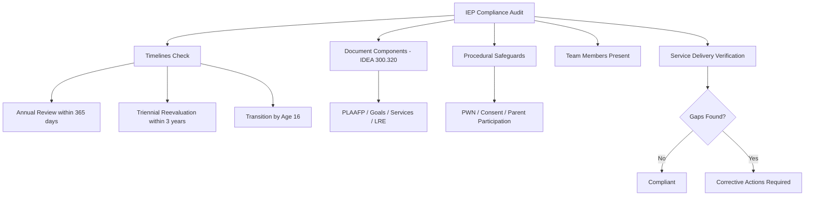

# IEP Compliance Checklist

**Student:** ___________________________ **DOB:** _____________ **Grade:** _____
**School:** ___________________________ **Case Manager:** ___________________________
**Audit Date:** _____________ **Auditor:** ___________________________

---

## Timelines

| Requirement | Due Date | Completed | Notes |
|-------------|----------|-----------|-------|
| Annual review (within 365 days of last IEP) | | ☐ | Last IEP date: _______ |
| Triennial reevaluation (within 3 years) | | ☐ | Last eval date: _______ |
| Evaluation completed within 60 calendar days of consent | N/A or: | ☐ | Consent date: _______ |
| IEP developed within 30 days of eligibility | N/A or: | ☐ | Eligibility date: _______ |
| Transition services in IEP (by age 16) | N/A or: | ☐ | Student DOB: _______ |
| Age of majority notice (1 year before 18th birthday) | N/A or: | ☐ | |

## IEP Document Components (IDEA §300.320)

| Component | Present? | Compliant? | Notes |
|-----------|----------|------------|-------|
| Present levels (PLAAFP) — academic | ☐ | ☐ | |
| Present levels (PLAAFP) — functional | ☐ | ☐ | |
| Measurable annual goals | ☐ | ☐ | Goals measurable? ☐ Yes ☐ No |
| Short-term objectives (if alternate assessment) | ☐ N/A | ☐ | |
| Progress measurement method | ☐ | ☐ | |
| Progress reporting schedule | ☐ | ☐ | |
| Special education services listed | ☐ | ☐ | |
| Related services listed | ☐ | ☐ | |
| Supplementary aids and services | ☐ | ☐ | |
| Service frequency, location, duration | ☐ | ☐ | |
| LRE justification (time outside gen ed) | ☐ | ☐ | |
| Assessment accommodations | ☐ | ☐ | |
| Alternate assessment justification (if applicable) | ☐ N/A | ☐ | |
| Service start and end dates | ☐ | ☐ | |
| ESY consideration documented | ☐ | ☐ | |
| AT consideration documented | ☐ | ☐ | |
| Behavior consideration (if applicable) | ☐ | ☐ | FBA/BIP needed? ☐ |
| Transition plan (age 16+) | ☐ N/A | ☐ | |
| Post-secondary goals (ed/training, employment, indep. living) | ☐ N/A | ☐ | |

## Procedural Safeguards

| Requirement | Met? | Date | Notes |
|-------------|------|------|-------|
| Procedural safeguards provided to parent | ☐ | | |
| Prior Written Notice (PWN) for proposed actions | ☐ | | |
| Parent consent for evaluation | ☐ | | |
| Parent consent for initial placement | ☐ | | |
| Parent invited to IEP meeting | ☐ | | |
| Parent participation documented | ☐ | | |
| Student invited (if transition-age) | ☐ N/A | | |

## IEP Team Members Present

| Required Member | Present? | Excused? | Notes |
|----------------|----------|----------|-------|
| Parent/Guardian | ☐ | ☐ | |
| Regular ed teacher | ☐ | ☐ | Written agreement if excused |
| Special ed teacher | ☐ | ☐ | |
| LEA representative | ☐ | ☐ | |
| Evaluation interpreter | ☐ | ☐ | |
| Student (if appropriate) | ☐ | ☐ N/A | |
| Other: _________________ | ☐ | ☐ | |

## Service Delivery Verification

| Service | IEP Minutes/Frequency | Actual Delivered | Gap? | Notes |
|---------|----------------------|-----------------|------|-------|
| | | | ☐ | |
| | | | ☐ | |
| | | | ☐ | |

## Findings

☐ **Compliant** — No issues identified
☐ **Non-compliant** — Corrective actions required (list below)

| Finding | Corrective Action | Responsible | Deadline |
|---------|-------------------|------------|----------|
| | | | |
| | | | |

---

## Related Resources

- [Specialists Reference (IEP Process)](../../references/roles/specialists.md) -- full IEP process, timelines, required components, and dispute resolution
- [IEP Meeting Prep](../../templates/specialist/iep-meeting-prep.md) -- preparation guide for IEP team meetings
- [504 Plans & Forms](../../templates/specialist/plans-and-forms.md) -- Section 504 plan templates and forms
- [Discipline & Behavior](../../references/operations/discipline-behavior.md) -- PBIS, FBA/BIP, manifestation determination, and seclusion/restraint
- [Missouri Education Law](../../references/compliance/mo-education-law.md) -- IDEA, Section 504, FERPA, and procedural safeguards
