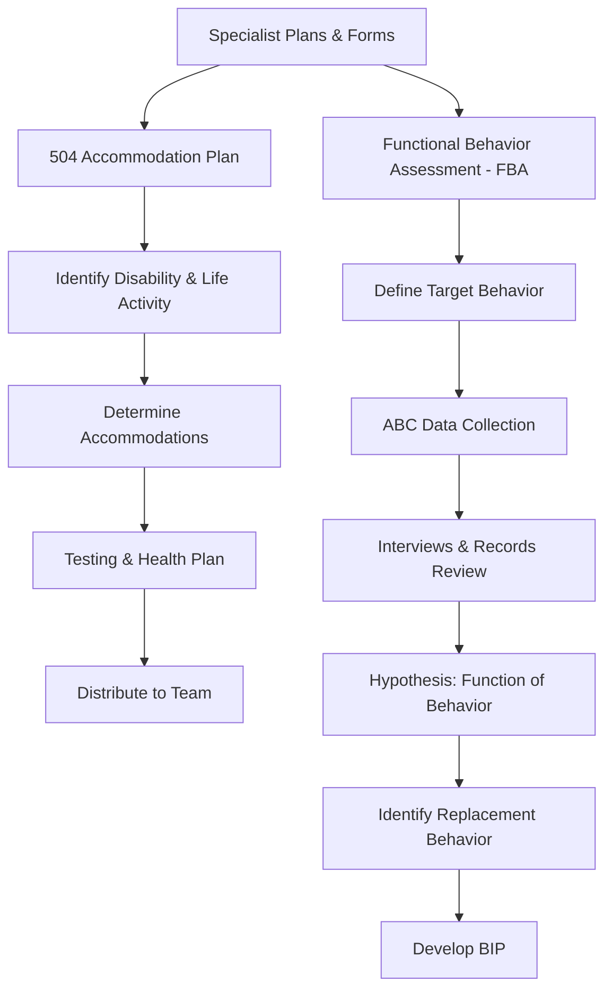

# Specialist Plans & Forms

## Table of Contents
- [504 Accommodation Plan Template](#504-accommodation-plan-template)
  - [Disability / Condition](#disability-condition)
  - [Major Life Activity Affected](#major-life-activity-affected)
  - [Accommodations](#accommodations)
  - [Testing Accommodations](#testing-accommodations)
  - [Health/Safety Plan (if applicable)](#healthsafety-plan-if-applicable)
  - [504 Team Members](#504-team-members)
- [Functional Behavior Assessment (FBA) Template](#functional-behavior-assessment-fba-template)
  - [1. Target Behavior Definition](#1-target-behavior-definition)
  - [2. Data Collection Summary](#2-data-collection-summary)
  - [3. Setting Events / Background Factors](#3-setting-events-background-factors)
  - [4. Interviews Conducted](#4-interviews-conducted)
  - [5. Records Review](#5-records-review)
  - [6. Hypothesis Statement](#6-hypothesis-statement)
  - [7. Replacement Behavior](#7-replacement-behavior)

## 504 Accommodation Plan Template

**Student:** ___________________________ **DOB:** _____________ **Grade:** _____
**School:** ___________________________ **504 Coordinator:** ___________________________
**Date of Meeting:** _____________ **Review Date:** _____________

---

### Disability / Condition
**Diagnosis:** ___________________________
**Diagnosed by:** ___________________________ **Date:** _____________
**Medical documentation on file:** ☐ Yes ☐ No

### Major Life Activity Affected
☐ Learning ☐ Reading ☐ Concentrating ☐ Thinking ☐ Communicating
☐ Breathing ☐ Walking ☐ Seeing ☐ Hearing ☐ Eating
☐ Sleeping ☐ Standing ☐ Bending ☐ Speaking ☐ Caring for oneself
☐ Other: ___________________________

### How the Disability Affects School Performance
_______________________________________________________________________________
_______________________________________________________________________________

### Accommodations

| # | Accommodation | Setting | Responsible Staff |
|---|--------------|---------|------------------|
| 1 | | ☐ All classes ☐ Specific: ___ | |
| 2 | | ☐ All classes ☐ Specific: ___ | |
| 3 | | ☐ All classes ☐ Specific: ___ | |
| 4 | | ☐ All classes ☐ Specific: ___ | |
| 5 | | ☐ All classes ☐ Specific: ___ | |

### Testing Accommodations
| Accommodation | Applies to: ☐ Classroom ☐ District ☐ State (MAP/EOC) |
|--------------|------|
| | |
| | |

### Health/Safety Plan (if applicable)
☐ Not applicable
☐ Individualized Healthcare Plan (IHP) on file — see school nurse
☐ Emergency plan attached: ___________________________

### 504 Team Members
| Name | Role | Signature |
|------|------|-----------|
| | Parent/Guardian | |
| | 504 Coordinator | |
| | Teacher | |
| | Other: ___ | |

### Distribution
☐ Parent copy provided ☐ Filed in student record ☐ All teachers notified
☐ Nurse notified ☐ Counselor notified ☐ Other: ___

---

## Functional Behavior Assessment (FBA) Template

**Student:** ___________________________ **DOB:** _____________ **Grade:** _____
**School:** ___________________________ **Completed by:** ___________________________
**Date:** _____________ **Reason for FBA:** ☐ IEP team request ☐ MDR ☐ Behavior concern ☐ Other

---

### 1. Target Behavior Definition
**Describe the behavior in observable, measurable terms:**
_______________________________________________________________________________

**What does it look like?** (topography)
_______________________________________________________________________________

**How often?** (frequency) _____ times per ☐ hour ☐ day ☐ week

**How long does each episode last?** (duration) _______________

**How intense?** (intensity — scale: mild / moderate / severe)  _______________

### 2. Data Collection Summary

### Direct Observation (ABC Data)
| Date | Time | Setting | Antecedent (What happened BEFORE) | Behavior (What the student DID) | Consequence (What happened AFTER) |
|------|------|---------|----------------------------------|--------------------------------|----------------------------------|
| | | | | | |
| | | | | | |
| | | | | | |
| | | | | | |

### When does the behavior occur MOST?
☐ Morning ☐ Afternoon ☐ Transitions ☐ Unstructured time ☐ Specific subject: ___
☐ With specific staff: ___ ☐ With specific peers: ___ ☐ Other: ___

### When does the behavior occur LEAST?
_______________________________________________________________________________

### 3. Setting Events / Background Factors
☐ Medication changes ☐ Sleep disruption ☐ Hunger ☐ Family stress ☐ Peer conflict
☐ Schedule change ☐ Substitute teacher ☐ Illness ☐ Sensory factors ☐ Other: ___

### 4. Interviews Conducted
| Person | Role | Key Information |
|--------|------|----------------|
| | Student | |
| | Teacher(s) | |
| | Parent | |
| | Para/aide | |
| | Other | |

### 5. Records Review
| Source | Relevant Findings |
|--------|--------------------|
| Discipline records | |
| Attendance | |
| Academic performance | |
| Prior FBAs/BIPs | |
| Medical/health | |

### 6. Hypothesis Statement

**When** [antecedent/trigger] ________________________________________,

**[Student]** [target behavior] ________________________________________,

**in order to** [obtain/escape/avoid] _________________________________________.

**The function of the behavior is:** ☐ Attention ☐ Escape/Avoidance ☐ Access to tangible ☐ Sensory

### 7. Replacement Behavior
**What appropriate behavior serves the same function?**
_______________________________________________________________________________

**Can the student currently perform this behavior?** ☐ Yes ☐ Partially ☐ No — needs instruction

### Next Step
→ Develop a Behavior Intervention Plan (BIP) based on these findings.

---

### Worked Example — Completed FBA

**Student:** Alex M. **DOB:** 05/12/2016 **Grade:** 3rd
**School:** Maple Ridge Elementary **Completed by:** Dr. Sarah Lin, Board Certified Behavior Analyst
**Date:** 03/15/2026 **Reason for FBA:** ☒ IEP team request ☐ MDR ☒ Behavior concern ☐ Other

**Eligibility Category:** Emotional Disturbance

---

#### 1. Target Behavior Definition
**Describe the behavior in observable, measurable terms:**
Elopement — Alex leaves the assigned area (classroom, specials room, cafeteria, or designated small-group space) without adult permission.

**What does it look like?** (topography)
Alex stands up, walks or runs to the classroom door, opens it, and exits into the hallway. Sometimes Alex goes to the restroom, the library, or sits in the hallway near the water fountain. On two occasions Alex exited the building to the playground.

**How often?** (frequency) **3** times per ☒ day (average over 10-day observation window; range 1-5 per day)

**How long does each episode last?** (duration) 4-12 minutes before staff locate and redirect Alex back to the assigned area

**How intense?** (intensity — scale: mild / moderate / severe) **Moderate** — Alex does not become aggressive when redirected but resists returning verbally ("I'm not going back"). On two occasions (building exit) intensity was **severe** due to safety risk.

#### 2. Data Collection Summary

#### Direct Observation (ABC Data)
| Date | Time | Setting | Antecedent (What happened BEFORE) | Behavior (What the student DID) | Consequence (What happened AFTER) |
|------|------|---------|----------------------------------|--------------------------------|----------------------------------|
| 03/03 | 9:15 AM | ELA class | Teacher gave written assignment (paragraph writing); class was quiet | Alex put head on desk for 1 min, then stood and walked out of room | Para followed Alex to hallway; Alex sat by water fountain for 8 min; para walked Alex back; missed remainder of writing task |
| 03/03 | 1:40 PM | Math class | Transition from group activity to independent worksheet | Alex asked to go to restroom; teacher said "after you start your worksheet"; Alex walked out | Teacher called office; Alex found in library; returned after 10 min; completed partial worksheet |
| 03/04 | 10:00 AM | Science lab | Teacher gave multi-step written directions for experiment; no visual supports provided | Alex left the room without saying anything | Para redirected from hallway after 5 min; Alex returned and completed the experiment with 1:1 support |
| 03/05 | 9:20 AM | ELA class | Writing task — journal prompt with no sentence starters | Alex asked for help; teacher said "try on your own first"; Alex left 2 min later | Office called parent; Alex sat in counselor's office for 12 min; did not complete journal entry |
| 03/06 | 2:10 PM | Social Studies | Independent reading — text above Alex's reading level | Alex fidgeted, flipped pages, then walked out | Para found Alex in hallway; Alex said "That book is boring and too hard" |

#### When does the behavior occur MOST?
☒ Morning ☐ Afternoon ☐ Transitions ☐ Unstructured time ☒ Specific subject: ELA (writing tasks)
☐ With specific staff ☐ With specific peers ☐ Other

#### When does the behavior occur LEAST?
During preferred activities (art, PE, music), during hands-on activities (science experiments with support), and during small-group instruction with the special education teacher. Also rare during lunch and recess.

#### 3. Setting Events / Background Factors
☐ Medication changes ☒ Sleep disruption ☐ Hunger ☒ Family stress ☐ Peer conflict
☐ Schedule change ☐ Substitute teacher ☐ Illness ☐ Sensory factors ☐ Other

Notes: Alex's parents are going through a separation. Mother reports Alex has difficulty sleeping and often arrives at school tired, especially on Mondays. Elopement frequency is higher on Mondays (average 4.2x) vs. other days (average 2.4x).

#### 4. Interviews Conducted
| Person | Role | Key Information |
|--------|------|----------------|
| Alex M. | Student | "I leave when the work is too hard. I don't like writing. My hand gets tired and I can't think of what to say." |
| Ms. Torres | Gen Ed Teacher (ELA/Math) | "Alex shuts down during independent writing. He does better in small groups. He doesn't cause problems — he just leaves." |
| Mr. Davis | Parent | "Alex has always struggled with writing. He gets frustrated easily. At home he'll leave the room when he's upset." |
| Mrs. Johnson | Paraprofessional | "Alex usually goes to the same few spots. He's calm when I find him. He comes back without a fight but looks defeated." |
| Ms. Rivera | Special Ed Teacher | "In my small group Alex does fine. He'll attempt writing with sentence starters and graphic organizers. He needs the scaffold." |

#### 5. Records Review
| Source | Relevant Findings |
|--------|--------------------|
| Discipline records | 14 office referrals this year for elopement; 0 for aggression or defiance |
| Attendance | 92% attendance; 6 tardies (mostly Mondays) |
| Academic performance | Reading: below grade level (DRA Level 20, grade-level expectation 30). Writing: significantly below grade level. Math: approaching grade level. |
| Prior FBAs/BIPs | No prior FBA. Informal behavior plan from 2nd grade focused on positive reinforcement — discontinued when behavior initially decreased, then resurfaced this year. |
| Medical/health | No medications. Diagnosis: Emotional Disturbance (anxiety, emotional dysregulation). Sleep concerns per parent. |

#### 6. Hypothesis Statement

**When** Alex is presented with an independent writing task that he perceives as too difficult, particularly when no scaffolds (sentence starters, graphic organizers, or 1:1 support) are provided,

**Alex** leaves the assigned area without permission (elopement),

**in order to** escape/avoid the frustrating or overwhelming writing demand.

**The function of the behavior is:** ☐ Attention ☒ Escape/Avoidance ☐ Access to tangible ☐ Sensory

*Secondary reinforcer:* The elopement is maintained because Alex consistently avoids or delays the writing task. Upon return, expectations are often reduced or the task is skipped entirely.

#### 7. Replacement Behavior
**What appropriate behavior serves the same function?**
Alex will use a **break card** to request a 3-minute break at his seat or in a designated calm-down area before the task feels overwhelming. Alex will also use a **help card** to request scaffolded support (sentence starters, graphic organizer, or brief 1:1 check-in) before beginning independent writing tasks.

**Can the student currently perform this behavior?** ☒ Partially — Alex can request help verbally in small-group settings but does not use a self-advocacy strategy in the general education classroom before reaching the point of elopement. He will need explicit instruction and practice using the break/help card system.

#### Next Step for This Student
-> Develop a BIP that includes: (1) antecedent modifications — provide writing scaffolds proactively and chunk writing tasks; (2) teach and practice the break/help card system; (3) reinforce Alex for using the replacement behavior; (4) develop a safety protocol for elopement incidents while the new skills are being established.
