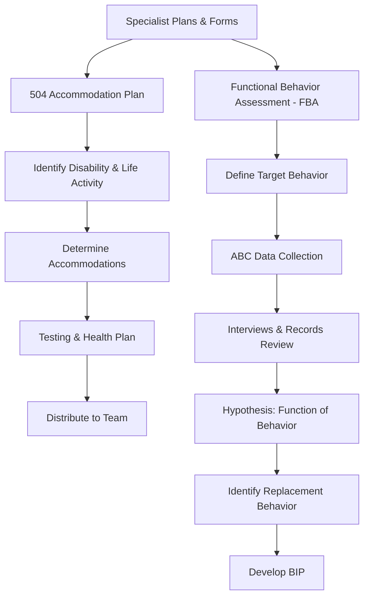

# Specialist Plans & Forms

## Table of Contents
- [504 Accommodation Plan Template](#504-accommodation-plan-template)
  - [Disability / Condition](#disability-condition)
  - [Major Life Activity Affected](#major-life-activity-affected)
  - [Accommodations](#accommodations)
  - [Testing Accommodations](#testing-accommodations)
  - [Health/Safety Plan (if applicable)](#healthsafety-plan-if-applicable)
  - [504 Team Members](#504-team-members)
- [Functional Behavior Assessment (FBA) Template](#functional-behavior-assessment-fba-template)
  - [1. Target Behavior Definition](#1-target-behavior-definition)
  - [2. Data Collection Summary](#2-data-collection-summary)
  - [3. Setting Events / Background Factors](#3-setting-events-background-factors)
  - [4. Interviews Conducted](#4-interviews-conducted)
  - [5. Records Review](#5-records-review)
  - [6. Hypothesis Statement](#6-hypothesis-statement)
  - [7. Replacement Behavior](#7-replacement-behavior)

## 504 Accommodation Plan Template

**Student:** ___________________________ **DOB:** _____________ **Grade:** _____
**School:** ___________________________ **504 Coordinator:** ___________________________
**Date of Meeting:** _____________ **Review Date:** _____________

---

### Disability / Condition
**Diagnosis:** ___________________________
**Diagnosed by:** ___________________________ **Date:** _____________
**Medical documentation on file:** ☐ Yes ☐ No

### Major Life Activity Affected
☐ Learning ☐ Reading ☐ Concentrating ☐ Thinking ☐ Communicating
☐ Breathing ☐ Walking ☐ Seeing ☐ Hearing ☐ Eating
☐ Sleeping ☐ Standing ☐ Bending ☐ Speaking ☐ Caring for oneself
☐ Other: ___________________________

### How the Disability Affects School Performance
_______________________________________________________________________________
_______________________________________________________________________________

### Accommodations

| # | Accommodation | Setting | Responsible Staff |
|---|--------------|---------|------------------|
| 1 | | ☐ All classes ☐ Specific: ___ | |
| 2 | | ☐ All classes ☐ Specific: ___ | |
| 3 | | ☐ All classes ☐ Specific: ___ | |
| 4 | | ☐ All classes ☐ Specific: ___ | |
| 5 | | ☐ All classes ☐ Specific: ___ | |

### Testing Accommodations
| Accommodation | Applies to: ☐ Classroom ☐ District ☐ State (MAP/EOC) |
|--------------|------|
| | |
| | |

### Health/Safety Plan (if applicable)
☐ Not applicable
☐ Individualized Healthcare Plan (IHP) on file — see school nurse
☐ Emergency plan attached: ___________________________

### 504 Team Members
| Name | Role | Signature |
|------|------|-----------|
| | Parent/Guardian | |
| | 504 Coordinator | |
| | Teacher | |
| | Other: ___ | |

### Distribution
☐ Parent copy provided ☐ Filed in student record ☐ All teachers notified
☐ Nurse notified ☐ Counselor notified ☐ Other: ___

---

## Functional Behavior Assessment (FBA) Template

**Student:** ___________________________ **DOB:** _____________ **Grade:** _____
**School:** ___________________________ **Completed by:** ___________________________
**Date:** _____________ **Reason for FBA:** ☐ IEP team request ☐ MDR ☐ Behavior concern ☐ Other

---

### 1. Target Behavior Definition
**Describe the behavior in observable, measurable terms:**
_______________________________________________________________________________

**What does it look like?** (topography)
_______________________________________________________________________________

**How often?** (frequency) _____ times per ☐ hour ☐ day ☐ week

**How long does each episode last?** (duration) _______________

**How intense?** (intensity — scale: mild / moderate / severe)  _______________

### 2. Data Collection Summary

### Direct Observation (ABC Data)
| Date | Time | Setting | Antecedent (What happened BEFORE) | Behavior (What the student DID) | Consequence (What happened AFTER) |
|------|------|---------|----------------------------------|--------------------------------|----------------------------------|
| | | | | | |
| | | | | | |
| | | | | | |
| | | | | | |

### When does the behavior occur MOST?
☐ Morning ☐ Afternoon ☐ Transitions ☐ Unstructured time ☐ Specific subject: ___
☐ With specific staff: ___ ☐ With specific peers: ___ ☐ Other: ___

### When does the behavior occur LEAST?
_______________________________________________________________________________

### 3. Setting Events / Background Factors
☐ Medication changes ☐ Sleep disruption ☐ Hunger ☐ Family stress ☐ Peer conflict
☐ Schedule change ☐ Substitute teacher ☐ Illness ☐ Sensory factors ☐ Other: ___

### 4. Interviews Conducted
| Person | Role | Key Information |
|--------|------|----------------|
| | Student | |
| | Teacher(s) | |
| | Parent | |
| | Para/aide | |
| | Other | |

### 5. Records Review
| Source | Relevant Findings |
|--------|--------------------|
| Discipline records | |
| Attendance | |
| Academic performance | |
| Prior FBAs/BIPs | |
| Medical/health | |

### 6. Hypothesis Statement

**When** [antecedent/trigger] ________________________________________,

**[Student]** [target behavior] ________________________________________,

**in order to** [obtain/escape/avoid] _________________________________________.

**The function of the behavior is:** ☐ Attention ☐ Escape/Avoidance ☐ Access to tangible ☐ Sensory

### 7. Replacement Behavior
**What appropriate behavior serves the same function?**
_______________________________________________________________________________

**Can the student currently perform this behavior?** ☐ Yes ☐ Partially ☐ No — needs instruction

### Next Step
→ Develop a Behavior Intervention Plan (BIP) based on these findings.
