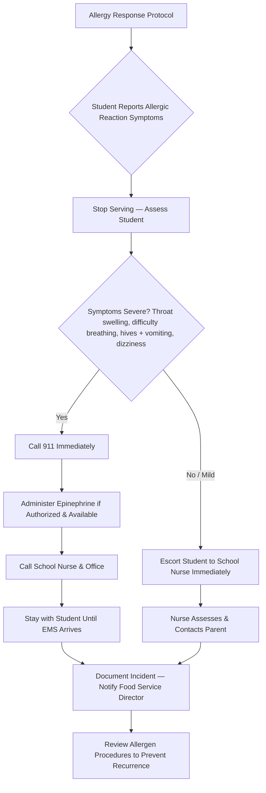

# Food Service Safety Guide

---

## Allergy Management Procedures

### Know Your Students
- Obtain the **allergy roster** from the school nurse at the start of each year and after every update
- Post the allergy roster in the kitchen (visible to all food service staff) in a location **not visible to students** to maintain confidentiality
- Review each student's **Allergy Action Plan** — know the allergen, symptoms, and required response
- Identify students who eat in the cafeteria daily and know their allergens by sight

### Prevention
- [ ] Read all ingredient labels and manufacturer allergen statements on every product, every delivery
- [ ] Check for allergen cross-contact during food preparation (shared equipment, utensils, surfaces)
- [ ] Use separate, color-coded utensils for allergen-free meal preparation when required
- [ ] Clean and sanitize all surfaces between preparing allergen-containing and allergen-free meals
- [ ] Never substitute ingredients without verifying allergen safety with the food service director
- [ ] Post the day's menu with common allergens flagged (milk, eggs, peanuts, tree nuts, wheat, soy, fish, shellfish, sesame)
- [ ] Train all staff — including substitutes — on allergen protocols at the start of the year and with each menu change

### Epinephrine Access
- Know the location of the student's prescribed **EpiPen** (typically with the nurse or in the classroom)
- If your district stocks **undesignated epinephrine** (RSMo 167.640), know where it is stored in the cafeteria area
- Only administer epinephrine if you have been **trained and authorized** by the school nurse
- After administering epinephrine, **always call 911** — epinephrine is a bridge, not a cure

---

## Free and Reduced Meal Program

### Community Eligibility Provision (CEP)
- Schools qualifying for CEP serve **free breakfast and lunch to all students** — no applications needed
- If your school participates in CEP, do NOT collect meal payments or identify students by pay status
- CEP eligibility is based on the school's **Identified Student Percentage (ISP)** from direct certification data

### Application Process (Non-CEP Schools)
- Distribute free/reduced meal applications to **every family** at the start of the year
- Applications are available year-round — a family may apply at any time
- Process applications within **10 operating days** of receipt
- Students must receive free meals while their application is being processed if they received free meals the prior year (carryover eligibility)

### Confidentiality (Critical)
- **Never** publicly identify a student's meal status (free, reduced, or paid)
- Do NOT use different lines, trays, cards, or wristbands that distinguish free/reduced students
- Do NOT announce a student's balance or meal status within earshot of other students
- Meal account information is **protected student data** under federal regulations (7 CFR 245.6)
- If a student has insufficient funds, serve the meal and handle the balance privately with the family through the office

---

## Food Safety / HACCP Basics

### Hazard Analysis Critical Control Points
Every food service operation must follow HACCP principles to prevent foodborne illness.

| HACCP Principle | Your Responsibility |
|-----------------|---------------------|
| **Hazard analysis** | Know the hazards (biological, chemical, physical) for each menu item |
| **Critical control points** | Monitor cooking, holding, and cooling temperatures |
| **Critical limits** | Cook to required internal temperatures; hold hot food at 135F+ and cold food at 41F or below |
| **Monitoring** | Check and log temperatures at every serving line, every meal period |
| **Corrective action** | Discard food that falls out of safe temperature range — do NOT serve it |
| **Verification** | Calibrate thermometers regularly; review logs with food service director |
| **Record keeping** | Maintain daily temperature logs, delivery records, and cleaning schedules |

### Daily Food Safety Checklist
- [ ] All staff: clean uniform, hair restraint, no jewelry on hands/wrists, hands washed
- [ ] Staff health check — any staff member with vomiting, diarrhea, or diagnosed illness must NOT work with food
- [ ] Refrigerator and freezer temperatures logged (fridge at or below 41F; freezer at or below 0F)
- [ ] Deliveries inspected: check temperatures, packaging integrity, expiration dates; reject items that fail
- [ ] Food prepared and cooked to required internal temperatures (log readings)
- [ ] Hot holding at 135F or above; cold holding at 41F or below — check every 30 minutes during service
- [ ] Leftovers cooled from 135F to 70F within 2 hours, then 70F to 41F within 4 more hours
- [ ] All surfaces, equipment, and utensils cleaned and sanitized between tasks
- [ ] Handwashing: after glove changes, touching face/hair, handling raw food, using restroom, handling trash

---

## Special Dietary Accommodations

### IEP / 504 Plan Accommodations
- Students with disabilities that affect their diet (e.g., diabetes, celiac disease, severe allergies, swallowing disorders) may have **meal accommodations written into their IEP or 504 plan**
- These accommodations are **legally required** — they are not optional preferences
- A licensed physician must sign a **Medical Statement for Special Dietary Needs** (USDA form) for meal substitutions
- Work with the school nurse and special education team to implement meal modifications
- Document all accommodations provided and keep records on file

### Religious and Medical Accommodations
- Religious dietary requests (halal, kosher, vegetarian) are handled at the district's discretion — check your district policy
- Medical dietary requests **with a physician's statement** must be accommodated under USDA regulations
- Maintain a list of students with special dietary needs and update it regularly with the school nurse

### Accommodation Tracking

| Student (initials) | Accommodation | Source (IEP/504/Medical) | Physician Statement on File? |
|---------------------|---------------|--------------------------|------------------------------|
| | | | [ ] Yes [ ] No |
| | | | [ ] Yes [ ] No |
| | | | [ ] Yes [ ] No |

---

## Communication with Nurse and Parents

### With the School Nurse
- Meet at the **start of the year** to review allergy rosters, medical dietary needs, and emergency plans
- Request updated information after any new enrollment, IEP meeting, or medical change
- Notify the nurse **immediately** when a student reports symptoms of an allergic reaction
- Coordinate on meal accommodations for students with diabetes, feeding tubes, or other medical needs
- Invite the nurse to review your allergen management procedures annually

### With Parents
- Direct parent questions about menu ingredients, allergens, and nutrition to the food service director
- Do NOT make promises about allergen-free meals without verifying with the food service director
- If a parent provides a physician's statement for a dietary accommodation, forward it to the food service director and nurse immediately
- Maintain confidentiality — do not discuss a student's dietary needs with other parents or students

---

## Emergency Procedures for Allergic Reactions

### Recognize the Signs

| Mild Symptoms | Severe Symptoms (Anaphylaxis) |
|---------------|-------------------------------|
| Hives, itching, rash | Throat tightness, difficulty breathing, wheezing |
| Tingling or swelling of lips/tongue | Swelling of face, lips, or tongue |
| Stomach pain, nausea | Vomiting or diarrhea combined with other symptoms |
| Sneezing, runny nose | Dizziness, fainting, loss of consciousness |
| | Rapid or weak pulse |
| | Feeling of impending doom |

### Response Steps
1. **Do NOT leave the student alone**
2. If symptoms are mild: escort the student to the **school nurse immediately**
3. If symptoms are severe (any sign of anaphylaxis):
   - Call **911** first
   - Administer **epinephrine** (EpiPen) if you are trained and authorized — inject into outer thigh through clothing
   - Call the **school nurse and office** immediately after administering
   - Lay the student down with legs elevated (unless they are vomiting or having difficulty breathing — then keep upright)
   - Be prepared to administer a **second dose** of epinephrine after 5-15 minutes if symptoms do not improve and EMS has not arrived
   - **Do NOT** give oral medication to a student who is having difficulty breathing or swallowing
4. Stay with the student until EMS arrives and provide the student's Allergy Action Plan to the paramedics
5. Notify the parent/guardian (school office will typically do this)

### After the Incident
- [ ] Complete an incident report within 24 hours
- [ ] Identify the allergen source — review the meal served, ingredients, and preparation process
- [ ] Meet with the food service director, nurse, and administrator to review what happened
- [ ] Update procedures to prevent recurrence
- [ ] Retrain staff if a process gap is identified
- [ ] Document all findings and corrective actions

---

## Quick Reference Card

| Item | Details |
|------|---------|
| **Emergency (anaphylaxis)** | Call **911**, then administer EpiPen if trained |
| **School nurse extension** | _________________________ |
| **Food service director** | _________________________ |
| **Children's Division Hotline** | 1-800-392-3738 |
| **Mandated reporter law** | RSMo 210.115 |
| **Meal confidentiality regulation** | 7 CFR 245.6 |
| **Undesignated epinephrine law** | RSMo 167.640 |
| **USDA dietary accommodation form** | Medical Statement for Special Dietary Needs |
| **Hot holding temperature** | 135F or above |
| **Cold holding temperature** | 41F or below |
