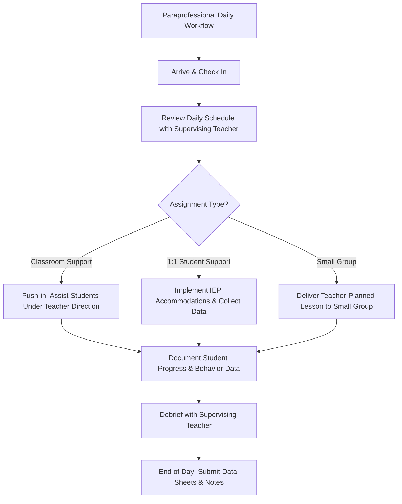

# Paraprofessional Guide

---

## ESSA Qualification Requirements

Under the Every Student Succeeds Act (ESSA), paraprofessionals working in Title I programs or Title I schoolwide buildings must meet **one** of the following:

| Pathway | Requirement |
|---------|-------------|
| **College coursework** | Completed at least **60 semester hours** of college credit from an accredited institution |
| **Associate's degree** | Hold an associate's degree (or higher) from an accredited institution |
| **Assessment** | Passed the Missouri ParaPro Assessment or approved local assessment demonstrating knowledge in reading, writing, and math |

**Important notes:**
- Your district HR office must have documentation of your qualification on file
- If you are unsure whether you meet the requirement, ask your building administrator or HR
- Paraprofessionals in non-Title I buildings are still encouraged to meet these standards
- Missouri DESE tracks paraprofessional qualifications through the Core Data system

---

## Scope of Duties: What Paras CAN and CANNOT Do

### What You CAN Do (Under Teacher Supervision)
- [x] Provide one-on-one or small-group reinforcement of lessons **planned by the teacher**
- [x] Assist students with assignments and classwork
- [x] Implement accommodations and modifications listed in a student's IEP or 504 plan
- [x] Collect behavioral and academic data as directed
- [x] Monitor students during transitions, lunch, recess, and arrival/dismissal
- [x] Read tests aloud or scribe answers for students with accommodations
- [x] Assist with personal care needs (toileting, feeding, mobility) if assigned
- [x] Prepare materials and set up learning stations
- [x] Supervise students during independent work time
- [x] Support classroom behavior management under the teacher's plan

### What You CANNOT Do Independently
- ✗ **Plan or design instruction** — the teacher must create all lesson plans
- ✗ **Introduce new concepts or skills** without teacher direction
- ✗ **Make instructional decisions** about what a student should learn
- ✗ **Modify IEP goals or accommodations** — only the IEP team can do this
- ✗ **Conduct parent conferences** without the supervising teacher present
- ✗ **Assign grades** — the teacher of record assigns all grades
- ✗ **Administer discipline** beyond the teacher's established plan
- ✗ **Serve as a substitute teacher** for extended periods without proper credentials (Missouri requires a valid substitute certificate)

---

## Working with IEP Students

### Accommodation Implementation
- Review each assigned student's IEP accommodation page **at the start of the year** and after every IEP meeting
- Ask the special education teacher to clarify any accommodation you do not understand
- Common accommodations you may implement:
  - [ ] Extended time on assignments and tests
  - [ ] Preferential seating
  - [ ] Read-aloud for tests and assignments
  - [ ] Scribe for written responses
  - [ ] Breaks during extended tasks
  - [ ] Use of graphic organizers or visual supports
  - [ ] Simplified or repeated directions
  - [ ] Behavior support (token boards, check-in/check-out, sensory tools)

### Data Collection
Accurate data is critical to IEP progress monitoring. You may be asked to record:

| Data Type | How to Record |
|-----------|---------------|
| **Frequency** | Tally marks each time a target behavior occurs |
| **Duration** | Start/stop timer for how long a behavior lasts |
| **Task completion** | Percentage of items completed or correct |
| **Prompt level** | Record level of support needed (independent, verbal, gestural, physical) |
| **Anecdotal notes** | Brief, objective description of what happened (no opinions) |

**Tips for good data:**
- Record data **in the moment** or immediately after — do not rely on memory
- Use the data sheets provided by the special education teacher
- Be **objective** — write what you observed, not what you interpreted
- Submit data sheets to the supervising teacher on the agreed schedule (daily or weekly)

---

## Mandated Reporter Responsibilities

**You are a mandated reporter under Missouri law (RSMo 210.115).** This applies to ALL school employees, including paraprofessionals.

- If you have **reasonable cause to suspect** abuse or neglect, you must report immediately
- **Call the Children's Division Hotline: 1-800-392-3738** (24 hours, 7 days)
- You do NOT need permission from your supervisor to call
- You do NOT need proof — suspicion is sufficient
- Document the report (date, time, reference number) and notify your building administrator
- See the full Mandated Reporter Quick Reference in `templates/staff/checklists.md` for detailed guidance

**Failure to report is a Class A misdemeanor (RSMo 210.165).**

---

## Professional Boundaries with Students

Paraprofessionals often develop close relationships with students, especially in 1:1 assignments. Maintain appropriate boundaries:

- **Do** be warm, encouraging, and supportive
- **Do** maintain the same professional standards as certified staff
- **Do not** share personal contact information (phone number, social media) with students or families
- **Do not** transport students in your personal vehicle
- **Do not** give students gifts without administrator approval
- **Do not** meet with students outside of school without written parent and administrator consent
- **Do not** discuss your personal life or problems with students
- **Promote independence** — the goal is to help the student succeed without you, not to create dependency
- **Fade support** as the student demonstrates mastery — consult with the supervising teacher about when and how to reduce prompts

---

## Communication with Supervising Teacher

Effective communication with your supervising teacher is essential to student success.

### Daily Communication
- [ ] Review the daily schedule and any changes before students arrive
- [ ] Ask clarifying questions about lesson plans or accommodations
- [ ] Report any student concerns (behavioral, emotional, academic) the same day
- [ ] Submit data sheets and anecdotal notes on the agreed schedule

### When to Escalate Immediately
- Student makes a statement about self-harm or harm to others
- Student discloses abuse or neglect
- Student has a medical emergency (seizure, allergic reaction, injury)
- Student elopes (leaves the assigned area without permission)
- A conflict or safety concern arises that you cannot manage safely

### Best Practices
- Use a shared communication log (binder, digital document, or app) for non-urgent items
- Attend team meetings and IEP meetings when invited — your observations are valuable
- Ask for feedback on your work regularly
- If you disagree with an instructional decision, discuss it privately with the teacher, not in front of students

---

## Emergency Procedures Checklist

Know your role in every emergency scenario. Review these with your building administrator at the start of each year.

- [ ] **Fire drill:** Know your evacuation route and assigned role (head count, door check, student assistance)
- [ ] **Tornado/severe weather:** Know your shelter location; assist students with mobility needs
- [ ] **Lockdown (intruder):** Lock door, move students away from windows/doors, remain silent, account for all students
- [ ] **Lockout (external threat):** Continue instruction, ensure exterior doors are locked, do not allow students outside
- [ ] **Medical emergency:** Call the office/nurse immediately; if trained, begin first aid/CPR; do NOT move an injured student unless there is immediate danger
- [ ] **Student elopement:** Notify the office and supervising teacher immediately; follow the building protocol (do NOT chase a student off campus alone)
- [ ] **AED location:** Know where the nearest AED is located in your building
- [ ] **Emergency contacts:** Know how to reach the office, nurse, and administrator quickly (phone extension, radio channel)

---

## Quick Reference Card

| Item | Details |
|------|---------|
| **Children's Division Hotline** | 1-800-392-3738 |
| **ESSA qualification** | 60 hours / associate's / assessment |
| **Key law: mandated reporting** | RSMo 210.115 |
| **Key law: failure to report** | RSMo 210.165 |
| **Key law: background checks** | RSMo 168.133 |
| **Data sheets due** | Per supervising teacher schedule |
| **My supervising teacher** | _________________________ |
| **My building administrator** | _________________________ |
| **Nurse extension** | _________________________ |
| **Office extension** | _________________________ |
