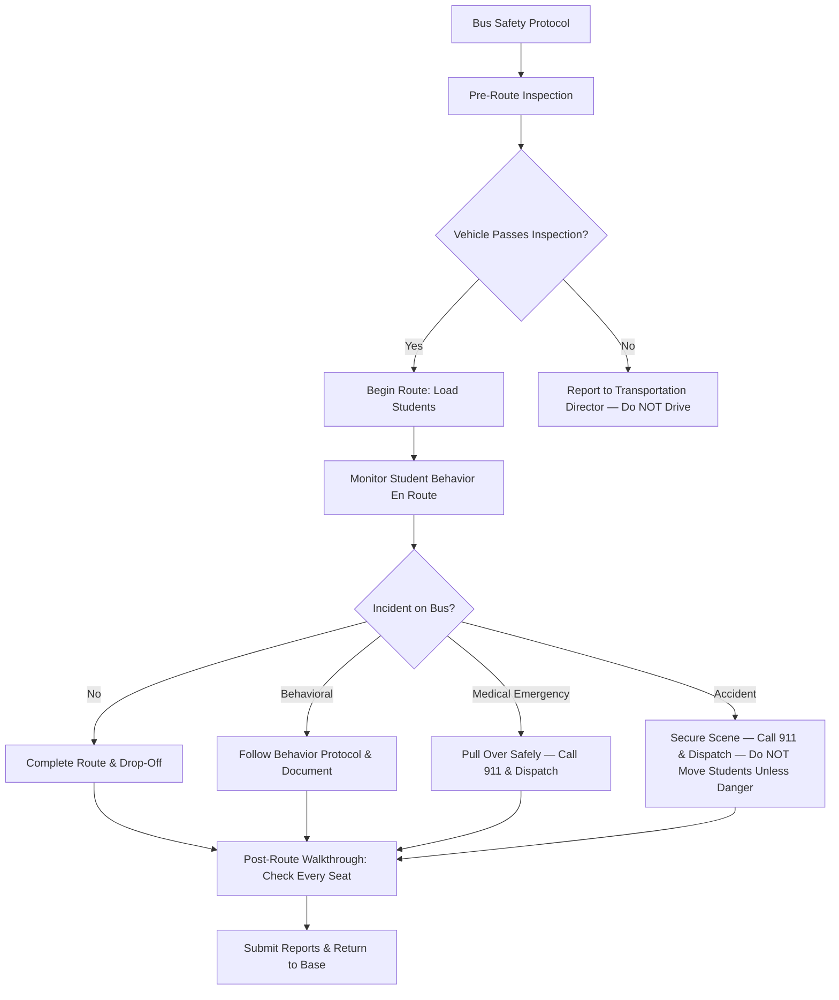

# Transportation Safety Guide

---

## Pre-Route Inspection Checklist

**Complete this inspection BEFORE every route. Do NOT operate a bus that fails any critical item.**

### Exterior Check
- [ ] Walk around the bus — check for body damage, fluid leaks, flat tires
- [ ] All lights functional (headlights, brake lights, turn signals, hazard flashers, strobes)
- [ ] Stop arm extends and retracts properly
- [ ] Crossing gate (if equipped) operates correctly
- [ ] Mirrors clean and properly adjusted (left flat, left convex, right flat, right convex, crossover)
- [ ] Emergency door opens and closes from inside and outside; alarm sounds when opened
- [ ] Tires: adequate tread depth, no cuts or bulges, proper inflation

### Interior Check
- [ ] Engine starts and runs smoothly; gauges within normal range
- [ ] Brakes: service brake firm, parking brake holds
- [ ] Steering: no excessive play
- [ ] Horn operates
- [ ] Windshield wipers and washers functional
- [ ] Heater / defroster operational
- [ ] All seats secure and in good repair
- [ ] Aisle clear of debris and obstructions
- [ ] First aid kit present and stocked
- [ ] Fire extinguisher present, charged, and accessible
- [ ] Reflective triangles / emergency warning devices on board
- [ ] Body fluid cleanup kit on board
- [ ] Two-way radio or communication device operational
- [ ] Child safety reminder system (CSRS) operational — **you must complete the post-route walkthrough**

---

## Student Behavior Management on the Bus

### Expectations (Post These Rules Visibly on the Bus)
1. Remain seated and facing forward while the bus is in motion
2. Keep hands, feet, and objects to yourself
3. Use appropriate language and volume
4. Follow the driver's instructions the first time
5. No eating or drinking (unless medically required)
6. Keep the aisle clear at all times

### Progressive Response
| Level | Behavior | Response |
|-------|----------|----------|
| **1 — Minor** | Loud talking, standing briefly, minor horseplay | Verbal redirect; reassign seat if needed |
| **2 — Moderate** | Repeated minor offenses, profanity, throwing objects | Written bus conduct report to school office; possible assigned seat |
| **3 — Major** | Fighting, bullying, threats, vandalism, leaving seat while moving | Pull over safely if needed; radio dispatch; written report; administrator conference |
| **4 — Severe** | Weapon, assault on driver, sexual misconduct, substance use | Pull over safely; call 911 and dispatch immediately; do NOT physically intervene unless imminent danger |

**Key rules for drivers:**
- Never drive while actively managing a behavioral crisis — pull over safely first
- Never deny a student the ride home as punishment — contact the school office
- Document every incident the same day using the district's incident report form

---

## Emergency Procedures

### Vehicle Accident
1. Stop the bus and turn off the engine (unless doing so creates additional danger)
2. Activate hazard flashers
3. Call **911** and then dispatch/transportation office
4. Check for injuries — do NOT move injured students unless there is immediate danger (fire, submersion)
5. If safe, deploy reflective triangles
6. Account for all students by name — use your roster
7. Keep students on the bus unless evacuation is necessary
8. Do NOT discuss fault with other drivers or bystanders
9. Complete the district accident report before end of day

### Medical Emergency
1. Pull over to a safe location and secure the bus
2. Call **911** — provide exact location, nature of emergency, student age
3. Radio dispatch immediately
4. Administer first aid if trained (bleeding control, CPR, AED if available)
5. If the student has a known medical plan (seizure, diabetes, severe allergy), follow it
6. Do NOT administer medication unless you have specific written authorization
7. Keep other students calm and seated
8. Remain with the student until EMS arrives

### Severe Weather
- **Tornado warning while en route:** Do NOT return to school. Drive away from the storm path if possible. If you cannot outrun it, evacuate the bus and move students to the nearest low-lying area or sturdy building. Students should lie flat and cover their heads. Do NOT shelter under the bus.
- **Flash flooding:** Never drive through standing water. Turn around and find an alternate route. Radio dispatch for guidance.
- **Ice/snow:** Reduce speed, increase following distance, and radio dispatch if conditions are unsafe. You have the authority to stop and wait for conditions to improve.

### Evacuation Procedure
1. Determine whether front-door or rear-door evacuation is safest
2. Direct the two oldest or most capable students to exit first and assist others
3. Students cross to a safe location at least **100 feet** from the bus
4. Conduct a head count using your roster
5. Do NOT re-enter the bus once evacuated unless there is a student who cannot self-evacuate

---

## Special Needs Student Transport

### Wheelchair Students
- [ ] Wheelchair securements inspected daily — straps, tracks, and floor anchors in good condition
- [ ] Secure wheelchair at **all four** floor anchor points AND apply the wheelchair's own brakes
- [ ] Use lap belt and shoulder harness on the student as required by IEP transportation plan
- [ ] Lift operation: confirm lift platform is clean, non-slip surface intact, railings secure
- [ ] Never operate the lift without training certification
- [ ] Practice loading/unloading procedure with the student and family at the start of the year

### Students with Behavioral Plans
- Review the student's **Behavioral Transportation Plan** (BTP) before the first day of service
- Know the student's triggers, de-escalation strategies, and reinforcers
- If a 1:1 aide is assigned, coordinate seating and communication signals
- Document behavioral incidents and share with the school and transportation director

### Students with Medical Needs
- Know which students have medical conditions (seizures, diabetes, severe allergies)
- Verify that any required equipment (EpiPen, glucose tablets) is on the bus per the student's health plan
- Know the location of the student's emergency health card

---

## Mandated Reporter Duties

**All school bus drivers are mandated reporters under Missouri law (RSMo 210.115).**

You may observe signs of abuse or neglect that other school staff do not see — bruises during boarding, inappropriate clothing for weather, children left unsupervised at bus stops, or student disclosures during the ride.

- If you have **reasonable cause to suspect** abuse or neglect, call the **Children's Division Hotline: 1-800-392-3738**
- You do NOT need permission from your supervisor or the school
- You do NOT need proof — suspicion is enough
- Document and notify your transportation director and building administrator
- See `templates/staff/checklists.md` for the full Mandated Reporter Quick Reference

---

## Communication with School Office

- **Before route:** Report any mechanical concerns to the transportation director
- **During route:** Radio dispatch for any delays, incidents, weather issues, or route changes
- **After route:** Report behavioral incidents, submit written reports, and flag any student welfare concerns to the building office
- **Student changes:** Do not change a student's stop, add a rider, or alter the route without written authorization from the school office or transportation director
- **Parent communication:** Direct parent questions or complaints to the school office — do not negotiate route changes or discipline with parents at the bus stop

---

## Incident Reporting Form Template

**Complete this form for any behavioral, medical, or safety incident. Submit to the Transportation Director and building administrator within 24 hours.**

| Field | Details |
|-------|---------|
| **Date:** | _____________ |
| **Time:** | _____________ |
| **Route #:** | _____________ |
| **Bus #:** | _____________ |
| **Driver:** | _____________ |
| **Location:** | _____________ |

**Students Involved:**

| Name | Grade | School |
|------|-------|--------|
| | | |
| | | |

**Type of Incident:**
- [ ] Behavioral
- [ ] Medical emergency
- [ ] Vehicle accident
- [ ] Weather-related
- [ ] Other: _____________

**Description of Incident** (who, what, when, where — objective facts only):

_____________________________________________________________________________
_____________________________________________________________________________
_____________________________________________________________________________

**Action Taken:**

_____________________________________________________________________________
_____________________________________________________________________________

**Witnesses:**

| Name | Role |
|------|------|
| | |
| | |

| | Signature | Date |
|---|-----------|------|
| **Driver** | | |
| **Transportation Director** | | |
| **Building Administrator** | | |
