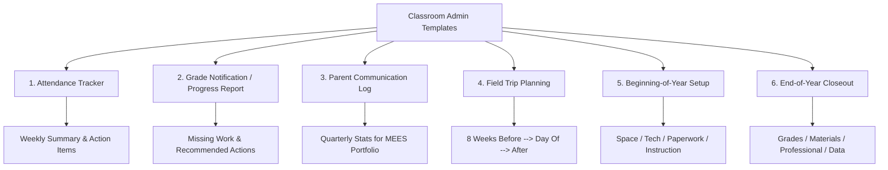

# Teacher Templates — Classroom Admin & Time-Savers

## Template 1: Daily Attendance & Participation Tracker

**Teacher:** ___________________________ **Period/Class:** _______________
**Week of:** _______________

| Student Name | Mon | Tue | Wed | Thu | Fri | Notes |
|-------------|-----|-----|-----|-----|-----|-------|
| | | | | | | |
| | | | | | | |
| | | | | | | |
| | | | | | | |
| | | | | | | |
| | | | | | | |
| | | | | | | |
| | | | | | | |

**Key:** P = Present, A = Absent, T = Tardy, E = Excused absence, ISS = In-school suspension, OSS = Out-of-school suspension

### Weekly Summary
- Total absences this week: ___
- Students with 3+ absences this month: _______________________________________________
- Students approaching chronic absence (10%+ of school days): _______________________________________________
- Tardy pattern: _______________________________________________

**Action needed:**
- [ ] Contact parent for: _______________________________________________
- [ ] Refer to counselor: _______________________________________________
- [ ] Report to attendance office: _______________________________________________

**Missouri attendance context:** Compulsory attendance ages 7-17 (RSMo 167.031). Chronic absenteeism = missing 10%+ of school days (≈18 days/year). A+ scholarship requires 95% cumulative attendance. Report concerns to your building's attendance team.

---

## Template 2: Grade Notification — Progress Report

**Student:** ___________________________ **Class:** _______________
**Teacher:** ___________________________ **Date:** _______________
**Grading period:** _______________

### Current Standing

| Category | Current Grade | Class Average | Notes |
|----------|-------------|--------------|-------|
| Overall | | | |
| Tests/Quizzes | | | |
| Classwork | | | |
| Homework | | | |
| Participation | | | |

### Missing / Incomplete Work

| Assignment | Due Date | Points Possible | Status |
|-----------|----------|----------------|--------|
| | | | ☐ Missing ☐ Incomplete ☐ Late |
| | | | ☐ Missing ☐ Incomplete ☐ Late |
| | | | ☐ Missing ☐ Incomplete ☐ Late |

### Teacher Comments
☐ Student is performing well — keep it up
☐ Student is capable of better work — needs more effort
☐ Student is struggling — intervention recommended
☐ Missing work is the primary issue — completing it would raise the grade to approximately ___
☐ Student would benefit from tutoring / extra help in _______________
☐ Other: _______________________________________________

### Recommended Actions
- [ ] Student should attend tutoring on _______________
- [ ] Parent conference requested — please contact me at _______________
- [ ] Student should complete missing work by _______________
- [ ] Student has been referred to _______________ for additional support

**Parent signature:** ___________________________ **Date:** _______________

---

## Template 3: Parent Communication Log

Track all parent contacts in one place. Many districts require this documentation. It's also valuable evidence for your MEES evaluation (Standard 6: Effective Communication).

**Teacher:** ___________________________ **School Year:** _______________

| Date | Student | Parent Name | Method | Topic | Summary | Follow-Up Needed |
|------|---------|------------|--------|-------|---------|-----------------|
| | | | ☐ Call ☐ Email ☐ Conference ☐ Note | | | ☐ Yes ☐ No |
| | | | ☐ Call ☐ Email ☐ Conference ☐ Note | | | ☐ Yes ☐ No |
| | | | ☐ Call ☐ Email ☐ Conference ☐ Note | | | ☐ Yes ☐ No |
| | | | ☐ Call ☐ Email ☐ Conference ☐ Note | | | ☐ Yes ☐ No |
| | | | ☐ Call ☐ Email ☐ Conference ☐ Note | | | ☐ Yes ☐ No |
| | | | ☐ Call ☐ Email ☐ Conference ☐ Note | | | ☐ Yes ☐ No |
| | | | ☐ Call ☐ Email ☐ Conference ☐ Note | | | ☐ Yes ☐ No |
| | | | ☐ Call ☐ Email ☐ Conference ☐ Note | | | ☐ Yes ☐ No |

**Quarterly stats (for your MEES portfolio):**
- Total parent contacts this quarter: ___
- Positive contacts: ___ | Concern contacts: ___ | Informational: ___
- Conferences held: ___

---

## Template 4: Field Trip Planning Checklist

**Teacher:** ___________________________ **Date of Trip:** _______________
**Destination:** ___________________________ **Grade/Class:** _______________

### 8+ Weeks Before
- [ ] Get principal approval (verbal, then written)
- [ ] Submit field trip request form to office
- [ ] Confirm date with destination — get written confirmation
- [ ] Arrange transportation (district bus request form submitted by deadline: ___)
- [ ] Determine cost per student (if any): $___
- [ ] Identify funding source for students who cannot pay

### 4+ Weeks Before
- [ ] Send permission slips home (must be signed by parent/guardian)
- [ ] Include: destination, date, departure/return time, cost, lunch info, emergency contact
- [ ] Recruit chaperones: ___ needed (ratio: ___)
- [ ] All chaperones must have background checks on file (RSMo 168.133)
- [ ] Notify cafeteria if students need sack lunches
- [ ] Notify other teachers of student absences that day
- [ ] Plan for students NOT attending (alternative assignment)

### 1 Week Before
- [ ] Collect all permission slips — NO student goes without a signed slip
- [ ] Create student roster with emergency contacts and medical alerts
- [ ] Check IEP/504 accommodations — are any needed for the trip?
- [ ] Prepare first aid kit
- [ ] Confirm bus/transportation
- [ ] Review behavior expectations with students
- [ ] Distribute chaperone information packet (student groups, itinerary, emergency numbers)

### Day Of
- [ ] Take attendance before departure — compare to permission slips
- [ ] Bring: student roster, emergency contacts, first aid kit, cell phone, permission slips
- [ ] Assign chaperone groups
- [ ] Take attendance at each transition point
- [ ] Take attendance before return departure

### After
- [ ] Send thank-you note to destination
- [ ] Submit receipts for reimbursement
- [ ] Debrief with students (what did you learn?)

---

## Template 5: Beginning-of-Year Classroom Setup Checklist

**Teacher:** ___________________________ **Room:** _____ **School Year:** _______________

### Physical Space
- [ ] Desks/tables arranged for your teaching style (rows, groups, U-shape, stations)
- [ ] Teacher desk positioned to monitor the room
- [ ] Clear traffic flow — students can move without disruption
- [ ] Supply area organized and labeled
- [ ] Class library / reading corner set up (if applicable)
- [ ] Bulletin boards: ☐ Welcome ☐ Class expectations ☐ Content ☐ Student work space
- [ ] Word wall / anchor charts posted
- [ ] Clock visible to students
- [ ] Tissue, hand sanitizer, pencil sharpener accessible

### Technology
- [ ] Projector / smartboard working and tested
- [ ] Student devices charged and numbered
- [ ] LMS set up (Google Classroom / Canvas / Schoology): _______________
- [ ] Class codes / links printed for students
- [ ] Backup plan for tech failure (printed materials ready)

### Paperwork & Systems
- [ ] Class rosters printed (check for updates on day 1)
- [ ] Seating charts created (or plan for first-day arrangement)
- [ ] Grade book set up — categories and weights entered
- [ ] Classroom expectations document ready to distribute
- [ ] Syllabus / course overview ready
- [ ] Parent contact form / info sheet ready to send home
- [ ] Emergency sub binder created and in desk (see `templates/teacher/sub-binder.md`)

### Instructional Prep
- [ ] First week lesson plans complete
- [ ] First-day activities planned (icebreakers, expectations, routines practice)
- [ ] Routines to teach explicitly in week 1:
  - [ ] How to enter the room
  - [ ] Where to find the warm-up / bell ringer
  - [ ] How to turn in work
  - [ ] How to ask for help / use the restroom
  - [ ] What to do when finished early
  - [ ] How to transition between activities
  - [ ] How to pack up / dismiss
- [ ] Diagnostic / pre-assessment planned for week 1-2
- [ ] IEP/504 accommodation list received and reviewed

### Administrative
- [ ] Reviewed student IEPs and 504 plans for all classes
- [ ] Identified ELL students and WIDA levels
- [ ] Reviewed building emergency procedures
- [ ] Confirmed duty schedule (lunch, hall, bus)
- [ ] Completed required compliance training:
  - [ ] Mandated reporter (RSMo 210.115)
  - [ ] Blood-borne pathogens
  - [ ] Building safety / active threat
  - [ ] District technology acceptable use
  - [ ] Anti-harassment / Title IX
- [ ] Met mentor teacher (if applicable)
- [ ] Attended required PD days

---

## Template 6: End-of-Year Closeout Checklist

**Teacher:** ___________________________ **Room:** _____ **School Year:** _______________

### Grades & Records
- [ ] Final grades submitted by deadline: _______________
- [ ] Grade disputes resolved
- [ ] Missing grade documentation complete
- [ ] Failure notifications sent to parents (per district policy)
- [ ] Student records updated in SIS

### Student Materials
- [ ] Textbooks collected and counted — shortages reported to _______________
- [ ] Technology devices collected, counted, and checked for damage
- [ ] Student work / portfolios returned or filed
- [ ] Lost & found items addressed

### Classroom
- [ ] Personal items removed
- [ ] Furniture arranged per custodial request (stacked / moved for cleaning)
- [ ] Bulletin boards cleared (or left up per building policy)
- [ ] Refrigerator emptied and cleaned
- [ ] Supplies inventoried — order list submitted for next year
- [ ] Keys returned to _______________
- [ ] Room secured

### Professional
- [ ] PD hours logged and submitted for certificate renewal
- [ ] MEES evaluation paperwork signed
- [ ] PD growth plan completed or carried forward
- [ ] Mentor logs submitted (if applicable)
- [ ] MEES portfolio evidence organized and saved

### Planning Ahead
- [ ] Sub binder materials saved digitally for next year
- [ ] First-week plans noted (what worked this year, what to change)
- [ ] Student alerts passed to next year's teachers (per transition protocol)
- [ ] Curriculum notes for next year: what to keep, cut, add
- [ ] Summer PD registered (if planned)

### Data
- [ ] Assessment data analyzed and summarized for department/team
- [ ] Student growth evidence saved (for MEES Standard 2)
- [ ] Any mandated reporting documentation finalized
