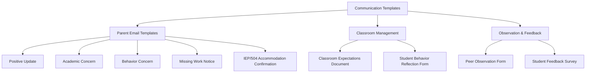

# Teacher Templates — Classroom & Communication

## Table of Contents
- [Parent Communication Email Templates](#parent-communication-email-templates)
  - [Template 1: Positive Behavior / Academic Update](#template-1-positive-behavior-academic-update)
  - [Template 2: Academic Concern — Early Intervention](#template-2-academic-concern-early-intervention)
  - [Template 3: Behavior Concern](#template-3-behavior-concern)
  - [Template 4: Missing Work Notification](#template-4-missing-work-notification)
  - [Template 5: IEP/504 Accommodation Confirmation](#template-5-iep504-accommodation-confirmation)
- [Classroom Management Templates](#classroom-management-templates)
  - [Template 6: Classroom Expectations Document](#template-6-classroom-expectations-document)
  - [Template 7: Student Behavior Reflection Form](#template-7-student-behavior-reflection-form)
- [Observation & Feedback Templates](#observation-feedback-templates)
  - [Template 8: Peer Observation Form](#template-8-peer-observation-form)
  - [Template 9: Student Feedback Survey (End of Unit/Semester)](#template-9-student-feedback-survey-end-of-unitsemester)

## Parent Communication Email Templates

### Template 1: Positive Behavior / Academic Update

**Subject:** Great news about [Student Name] in [Class]

Dear [Parent/Guardian Name],

I wanted to share some good news about [Student Name]'s progress in [class/subject].

**What I've noticed:**
[Specific, observable behavior or achievement — e.g., "Maya has been consistently participating in class discussions this week and turned in her research paper early with strong analysis."]

**Why it matters:**
[Connect to a skill or standard — e.g., "This shows she's building confidence in forming evidence-based arguments, which is a key skill for [grade level/subject]."]

**How you can support at home:**
[One specific suggestion — e.g., "If she wants to keep building on this, asking her to explain what she's learning at dinner is a great way to reinforce the skills."]

Thank you for your partnership in [Student Name]'s education.

[Teacher Name]
[Contact info]

---

### Template 2: Academic Concern — Early Intervention

**Subject:** Checking in about [Student Name] — [Class]

Dear [Parent/Guardian Name],

I'm reaching out because I want to address a concern early, while there's still time to make a positive change.

**What I'm seeing:**
[Specific, factual description — e.g., "Jordan has missed 3 of the last 5 homework assignments in math, and his quiz scores have dropped from B's to D's over the past two weeks."]

**What I've already tried:**
[List interventions attempted — e.g., "I've offered after-school help on Tuesdays, provided a study guide, and checked in with Jordan during class."]

**What would help:**
[Specific ask — e.g., "Could we set up a 10-minute phone call or meet before/after school this week? I'd like to work together on a plan before this becomes a bigger issue."]

I believe [Student Name] can turn this around with some support. Please reach out at [email] or [phone] and let me know what works for your schedule.

[Teacher Name]

---

### Template 3: Behavior Concern

**Subject:** Behavior update — [Student Name] — [Class]

Dear [Parent/Guardian Name],

I'm writing to let you know about a behavior concern in [class/period] so we can work on it together.

**What happened:**
[Factual, non-judgmental description — e.g., "On [date], [Student] was asked to put away their phone during instruction. They refused and used inappropriate language toward me when redirected."]

**What I did:**
[Your response — e.g., "I followed our classroom expectations: verbal warning, then a brief hallway conversation. [Student] returned to class and finished the period without further issue."]

**Consequence (if any):**
[e.g., "Per classroom policy, this is a second offense, so [Student] has a lunch detention on [date]." / "No formal consequence at this time — I'm reaching out to keep you informed."]

**What would help from home:**
[Specific — e.g., "A brief conversation about appropriate responses to adult directions would reinforce what we're working on at school."]

I want to emphasize that [Student Name] has a lot of strengths — [mention something positive]. Let's keep the lines of communication open.

[Teacher Name]

---

### Template 4: Missing Work Notification

**Subject:** Missing assignments — [Student Name] — [Class]

Dear [Parent/Guardian Name],

[Student Name] currently has the following missing assignments in [class]:

| Assignment | Due Date | Points | Status |
|-----------|----------|--------|--------|
| | | | Missing |
| | | | Missing |
| | | | Incomplete |

**Current grade impact:** [Student]'s grade is currently a [letter/percent]. Completing these assignments would bring it to approximately [letter/percent].

**Late work policy:** [State your/district's policy — e.g., "Per our syllabus, late work is accepted for up to 1 week at 80% credit. After that, students may complete it for feedback but not for grade."]

**Deadline for make-up:** [Date]

Please let me know if there are circumstances I should be aware of. I'm happy to work with [Student] on a plan to get caught up.

[Teacher Name]

---

### Template 5: IEP/504 Accommodation Confirmation

**Subject:** Accommodation implementation update — [Student Name]

Dear [Case Manager / Parent],

I'm writing to confirm the accommodations I'm implementing for [Student Name] in [class/period] per their [IEP / 504 plan]:

| Accommodation | How I'm Implementing It |
|--------------|------------------------|
| Extended time on tests | [Student] receives [X] additional minutes in [location] |
| Preferential seating | Seated [location — e.g., front row, near the door, away from distractions] |
| Copies of notes | Provided via [method — printed, digital, peer notes] |
| Reduced assignment length | Modified to [description — e.g., "10 problems instead of 20, focusing on the same skills"] |
| [Other] | [Description] |

**What's working well:**
[Observation — e.g., "The extended time has helped — [Student] is completing tests more thoroughly."]

**What may need adjustment:**
[Observation — e.g., "The note copies don't seem to be helping as much — [Student] isn't reviewing them. Could we discuss alternatives at the next IEP meeting?"]

Please let me know if I should adjust anything or if the team would like to meet.

[Teacher Name]

---

## Classroom Management Templates

### Template 6: Classroom Expectations Document

### [Teacher Name]'s [Subject] — Classroom Expectations

#### Our Learning Community
In this classroom, every student has the right to learn and every person has the right to be treated with respect.

#### Expectations
1. **Be prepared** — Bring materials. Be in your seat when the bell rings. Charge your device at home.
2. **Be respectful** — Listen when others speak. Use kind language. Respect differences.
3. **Be engaged** — Participate. Ask questions. Try your best even when it's hard.
4. **Be responsible** — Turn in your work. Own your mistakes. Ask for help when you need it.

#### What happens when expectations aren't met
| Step | Response |
|------|----------|
| 1st | Verbal redirect / private conversation |
| 2nd | Teacher-student conference (brief, after class) |
| 3rd | Parent contact (phone/email) |
| 4th | Office referral / team conference |

**Note:** Severe disruptions (threats, fighting, property destruction) skip to immediate office referral.

#### Grading
| Category | Weight |
|----------|--------|
| Assessments (tests, quizzes, projects) | ___% |
| Classwork / practice | ___% |
| Homework | ___% |
| Participation / engagement | ___% |

#### Late Work Policy
[State your policy]

#### How to Reach Me
- **Email:** [email] (preferred — I respond within 24 hours on school days)
- **Office hours:** [days/times]
- **Remind / ClassDojo / other:** [info]

---

### Template 7: Student Behavior Reflection Form

### Think About It

**Student:** ___________________________ **Date:** _______________
**Class/Period:** ___________________________ **Teacher:** _______________

**1. What happened?**
*(Describe what you did in your own words.)*

_______________________________________________________________________________

_______________________________________________________________________________

**2. What rule or expectation did this break?**

_______________________________________________________________________________

**3. How did this affect others?**
*(Think about your classmates, the teacher, and yourself.)*

_______________________________________________________________________________

_______________________________________________________________________________

**4. What could you do differently next time?**

_______________________________________________________________________________

**5. What do you need to make this right?**
☐ Apologize to _______________
☐ Complete missed work
☐ Follow the plan we discussed
☐ Other: _______________

**Student signature:** ___________________________ **Date:** _______________
**Teacher signature:** ___________________________ **Date:** _______________

---

## Observation & Feedback Templates

### Template 8: Peer Observation Form

### Peer Observation Record

**Observer:** ___________________________ **Date:** _______________
**Teacher observed:** ___________________________ **Subject/Grade:** _______________
**Focus area (agreed in advance):** _______________________________________________

#### What I Saw

| Time | What the teacher did | What students did |
|------|---------------------|-------------------|
| | | |
| | | |
| | | |
| | | |
| | | |

#### Strengths I Noticed
*(Connect to the agreed focus area when possible)*

1. _______________________________________________________________________________
2. _______________________________________________________________________________

#### Questions to Discuss
*(Curious, not evaluative — "I noticed X, what was your thinking?")*

1. _______________________________________________________________________________
2. _______________________________________________________________________________

#### One Thing I'm Taking Back to My Classroom

_______________________________________________________________________________

---

### Template 9: Student Feedback Survey (End of Unit/Semester)

### Help Me Teach You Better

*(This is anonymous. Be honest — your answers help me improve.)*

**Class:** ___________________________ **Date:** _______________

**1. What helped you learn the most in this class?**
☐ Class discussions  ☐ Group work  ☐ Videos/visuals  ☐ Practice problems
☐ Teacher explanations  ☐ Reading  ☐ Hands-on activities  ☐ Other: __________

**2. What made learning harder?**
☐ Pace too fast  ☐ Pace too slow  ☐ Unclear directions  ☐ Distractions from other students
☐ Not enough practice  ☐ Too much homework  ☐ Other: __________

**3. I feel comfortable asking questions in this class.**
☐ Strongly agree  ☐ Agree  ☐ Neutral  ☐ Disagree  ☐ Strongly disagree

**4. I feel like my teacher cares about my learning.**
☐ Strongly agree  ☐ Agree  ☐ Neutral  ☐ Disagree  ☐ Strongly disagree

**5. I feel like I belong in this class.**
☐ Strongly agree  ☐ Agree  ☐ Neutral  ☐ Disagree  ☐ Strongly disagree

**6. One thing I wish my teacher knew:**

_______________________________________________________________________________

**7. One thing I'd change about this class:**

_______________________________________________________________________________
