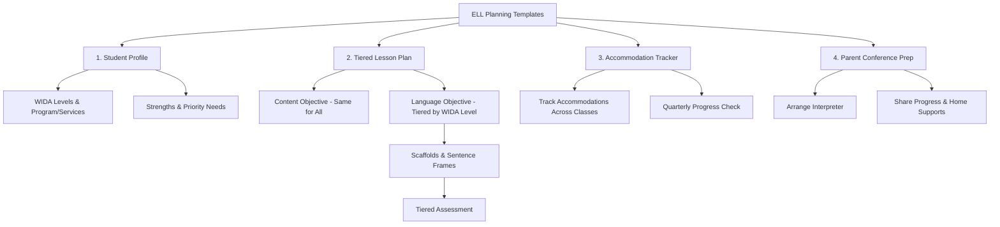

# Teacher Templates — ELL Lesson Planning & Student Profiles

## Table of Contents
- [Template 1: ELL Student Profile](#template-1-ell-student-profile)
  - [Current WIDA Proficiency Levels (from most recent ACCESS)](#current-wida-proficiency-levels-from-most-recent-access)
  - [Program & Services](#program-services)
  - [Strengths](#strengths)
  - [Priority Needs](#priority-needs)
  - [What Works for This Student](#what-works-for-this-student)
  - [Cultural Considerations](#cultural-considerations)
  - [Parent/Family Contact](#parentfamily-contact)
- [Template 2: Tiered Lesson Plan for ELL Differentiation](#template-2-tiered-lesson-plan-for-ell-differentiation)
  - [Content Objective (same for all students)](#content-objective-same-for-all-students)
  - [Language Objective (tiered)](#language-objective-tiered)
  - [Key Vocabulary](#key-vocabulary)
  - [Lesson Delivery — Differentiated by Level](#lesson-delivery-differentiated-by-level)
  - [Scaffolds Used in This Lesson](#scaffolds-used-in-this-lesson)
  - [Sentence Frames / Starters for This Lesson](#sentence-frames-starters-for-this-lesson)
  - [Assessment — How I'll Know They Got It](#assessment-how-ill-know-they-got-it)
  - [Reflection (After Teaching)](#reflection-after-teaching)
- [Template 3: ELL Accommodation Tracker](#template-3-ell-accommodation-tracker)
  - [Accommodations by Class](#accommodations-by-class)
  - [Common ELL Accommodations Checklist](#common-ell-accommodations-checklist)
  - [Quarterly Progress Check](#quarterly-progress-check)
- [Template 4: ELL Parent Conference Prep](#template-4-ell-parent-conference-prep)
  - [Before the Conference](#before-the-conference)
  - [Conference Agenda](#conference-agenda)
  - [Notes from Conference](#notes-from-conference)
  - [Follow-Up Actions](#follow-up-actions)

## Template 1: ELL Student Profile

**Student:** ___________________________ **Grade:** _____
**Home language:** ___________________________ **Country of origin:** _______________
**Date entered US schools:** _______________ **Date entered this district:** _______________
**Years in US schools:** ___

### Current WIDA Proficiency Levels (from most recent ACCESS)

| Domain | Level (1-6) | Score |
|--------|------------|-------|
| Listening | | |
| Speaking | | |
| Reading | | |
| Writing | | |
| **Overall Composite** | | |

### Program & Services
- [ ] Pull-out ESL (___ minutes/week)
- [ ] Push-in ESL (classes: ___________________________)
- [ ] Sheltered instruction (all classes)
- [ ] Newcomer program
- [ ] Dual language program
- [ ] Monitoring only (exited _______________)
- [ ] Also has IEP (disability: ___________________________)
- [ ] Also has 504 plan

### Strengths
*(What can this student do? Include home language literacy, content knowledge, social skills)*

_______________________________________________________________________________
_______________________________________________________________________________

### Priority Needs
*(What are the most important language and academic goals right now?)*

1. _______________________________________________________________________________
2. _______________________________________________________________________________
3. _______________________________________________________________________________

### What Works for This Student
*(Strategies, supports, grouping that help this student learn)*

_______________________________________________________________________________
_______________________________________________________________________________

### Cultural Considerations
*(Family communication preferences, cultural practices relevant to school, any sensitivities)*

_______________________________________________________________________________

### Parent/Family Contact
- **Primary contact:** ___________________________ **Relationship:** _______________
- **Language for communication:** ___________________________
- **Best way to reach:** ☐ Phone ☐ Text ☐ Written note ☐ App (___________)
- **Interpreter needed:** ☐ Yes ☐ No
- **Notes:** _______________________________________________

---

## Template 2: Tiered Lesson Plan for ELL Differentiation

**Teacher:** ___________________________ **Date:** _______________
**Subject:** ___________________________ **Grade:** _____

### Content Objective (same for all students)
*Missouri Learning Standard:* _______________________________________________
*Students will:* _______________________________________________

### Language Objective (tiered)

| WIDA Levels 1-2 | WIDA Levels 3-4 | WIDA Level 5+ |
|-----------------|-----------------|---------------|
| Students will [verb] using [support] | Students will [verb] using [support] | Students will [verb] |
| | | |

### Key Vocabulary

| Tier 2 (academic, cross-content) | Tier 3 (subject-specific) |
|--------------------------------|--------------------------|
| | |
| | |
| | |

**How I'll pre-teach vocabulary:**
☐ Picture cards ☐ Word wall ☐ Bilingual glossary ☐ TPR/gestures
☐ Student-friendly definitions ☐ Cognates identified ☐ Other: _______________

### Lesson Delivery — Differentiated by Level

| Lesson Phase | All Students | Levels 1-2 Adaptations | Levels 3-4 Adaptations |
|-------------|-------------|----------------------|----------------------|
| **Opening / hook** | | | |
| **Input (I do)** | | | |
| **Guided practice (We do)** | | | |
| **Independent practice (You do)** | | | |
| **Closure / assessment** | | | |

### Scaffolds Used in This Lesson

| Scaffold | ☐ | Details |
|----------|---|---------|
| Visual supports (images, diagrams, realia) | ☐ | |
| Word bank / vocabulary wall | ☐ | |
| Sentence frames | ☐ | |
| Sentence starters | ☐ | |
| Graphic organizer | ☐ | |
| Bilingual glossary / dictionary | ☐ | |
| Adapted / simplified text | ☐ | |
| Audio support (read-aloud, text-to-speech) | ☐ | |
| L1 peer support | ☐ | |
| Modeling / think-aloud | ☐ | |
| Extended time | ☐ | |
| Alternative response format (draw, label, oral) | ☐ | |

### Sentence Frames / Starters for This Lesson

**Levels 1-2:**
- _______________________________________________________________________________
- _______________________________________________________________________________

**Levels 3-4:**
- _______________________________________________________________________________
- _______________________________________________________________________________

### Assessment — How I'll Know They Got It

| Level | How students show understanding |
|-------|-------------------------------|
| Levels 1-2 | |
| Levels 3-4 | |
| Level 5+ | |

### Reflection (After Teaching)

*Did the scaffolds work? What would you adjust?*

_______________________________________________________________________________

*Which students need follow-up?*

_______________________________________________________________________________

---

## Template 3: ELL Accommodation Tracker

Use this to document and track accommodations for each ELL student across classes.

**Student:** ___________________________ **WIDA Composite Level:** _____
**School Year:** _______________ **ESL Teacher:** ___________________________

### Accommodations by Class

| Class/Teacher | Accommodations Provided | Working? (Y/N) | Notes |
|--------------|------------------------|----------------|-------|
| | | | |
| | | | |
| | | | |
| | | | |
| | | | |
| | | | |

### Common ELL Accommodations Checklist

**Input accommodations:**
- [ ] Simplified/adapted text
- [ ] Visual supports and graphic organizers
- [ ] Pre-taught vocabulary with pictures
- [ ] Bilingual glossary or dictionary
- [ ] Audio support (text-to-speech, read-aloud)
- [ ] L1 (home language) resources available
- [ ] Copies of notes provided
- [ ] Chunked/scaffolded directions

**Output accommodations:**
- [ ] Extended time on assignments and tests
- [ ] Sentence frames/starters provided
- [ ] Alternative response formats accepted (oral, drawing, labeling)
- [ ] Word bank on assessments
- [ ] Reduced written output (focus on quality, not quantity)
- [ ] Allow use of translation tools for comprehension

**Environment accommodations:**
- [ ] Preferential seating (near teacher, visual aids, bilingual peer)
- [ ] Small group instruction time
- [ ] Quiet testing space
- [ ] Bilingual peer buddy assigned

### Quarterly Progress Check

| Quarter | Listening | Speaking | Reading | Writing | Overall Progress | Accommodation Changes |
|---------|-----------|---------|---------|---------|-----------------|---------------------|
| Q1 | | | | | | |
| Q2 | | | | | | |
| Q3 | | | | | | |
| Q4 | | | | | | |

---

## Template 4: ELL Parent Conference Prep

**Student:** ___________________________ **Date:** _______________
**Interpreter needed:** ☐ Yes (Language: _______________) ☐ No
**Interpreter name:** ___________________________

### Before the Conference
- [ ] Arrange interpreter (NOT the student)
- [ ] Prepare translated documents if available
- [ ] Gather student work samples showing progress
- [ ] Have WIDA proficiency levels ready to explain in simple terms
- [ ] Prepare a visual showing the student's growth
- [ ] Plan to explain the grading system if family is unfamiliar

### Conference Agenda

**1. Welcome and relationship building** (2-3 min)
- Thank the family for coming
- Ask how things are going at home
- Share something positive about the student

**2. Academic and language progress** (5-7 min)
- Show WIDA levels in simple terms: "Your child understands English at level ___. Here's what that means..."
- Show student work samples — focus on growth, not just current level
- Explain grades in context: "A C in this class means ___ for an English learner at this level"

**3. What we're doing at school** (3-5 min)
- Explain ELL services simply: "Your child gets extra help with English ___ times per week"
- Describe classroom supports: "In class, we use pictures, word lists, and partner work to help"

**4. How you can help at home** (3-5 min)
- Read with your child in ANY language — home language literacy transfers to English
- Talk about school — in any language — ask about what they learned
- Encourage homework completion; it's okay to help in the home language
- Keep speaking your home language at home — bilingualism is an asset

**5. Questions and next steps** (3-5 min)
- Ask: "What questions do you have? What should I know about your child?"
- Set a follow-up plan
- Provide your contact information and how to reach you

### Notes from Conference

_______________________________________________________________________________
_______________________________________________________________________________

### Follow-Up Actions

| Action | Who | By When |
|--------|-----|---------|
| | | |
| | | |

---

### Worked Example — Scaffold Examples by WIDA Proficiency Level

The following examples show concrete scaffolds for a 4th-grade science lesson on the water cycle. The **content objective** is the same for all students: "Students will explain the three stages of the water cycle (evaporation, condensation, precipitation)." The scaffolds are tiered by WIDA proficiency level.

---

#### Level 1 — Entering (Minimal English Proficiency)

**Language Objective:** Students will label a diagram of the water cycle using key vocabulary words with picture support.

**Scaffolds:**
- **Picture vocabulary cards** — Each key term (evaporation, condensation, precipitation, water, sun, cloud, rain) paired with a clear image and the word in English and the student's home language
- **Word bank** posted on desk and on the board:
  > evaporation | condensation | precipitation | sun | cloud | water | rain | heat
- **Labeled diagram** — Provide a pre-drawn water cycle diagram with arrows. Student matches vocabulary cards to the correct location.
- **Sentence frame for verbal or written response:**
  > "The ___ is ___."
  > "The water goes ___."
  > "___ makes the water ___."
- **Total Physical Response (TPR):** Teacher models hand motions — wiggling fingers rising upward for evaporation, hands forming a cloud shape for condensation, fingers falling downward for precipitation. Students repeat.

**Assessment:** Student correctly labels all three stages on the diagram and verbally says or points to each stage using the sentence frame "The ___ is ___." (e.g., "The water is going up.")

---

#### Level 3 — Developing (Intermediate English Proficiency)

**Language Objective:** Students will write a short paragraph describing the water cycle using a paragraph frame, a graphic organizer, and academic vocabulary.

**Scaffolds:**
- **Graphic organizer** — A three-column chart:

  | Stage | What Happens | Key Vocabulary |
  |-------|-------------|----------------|
  | Evaporation | | heat, liquid, gas, rise, sun |
  | Condensation | | cool, gas, liquid, cloud, droplets |
  | Precipitation | | heavy, fall, rain, snow, sleet |

  Student fills in "What Happens" using their own words and the provided vocabulary.

- **Academic vocabulary list** with student-friendly definitions:
  > - **evaporation** — when water heats up and changes from liquid to gas (water vapor)
  > - **condensation** — when water vapor cools down and turns back into tiny water droplets (forms clouds)
  > - **precipitation** — when water droplets in clouds get heavy and fall as rain, snow, or sleet
  > - **water cycle** — the way water moves from the ground to the sky and back again, over and over

- **Paragraph frame:**
  > "The water cycle has three main stages. First, ___ happens when ___. Next, ___ occurs because ___. Finally, ___ takes place when ___. The water cycle is important because ___."

- **Sentence starters for discussion:**
  > "One difference between evaporation and condensation is ___."
  > "I think precipitation happens because ___."
  > "This reminds me of ___ because ___."

**Assessment:** Student completes the paragraph frame with accurate content. Writing includes at least 3 academic vocabulary terms used correctly. Student can verbally explain one stage to a partner using 2-3 complete sentences.

---

#### Level 5 — Bridging (Near-Native English Proficiency)

**Language Objective:** Students will write a multi-paragraph explanation of the water cycle using academic language, including cause-and-effect relationships, with scaffolds removed.

**Scaffolds (minimal — supports are being faded):**
- **No sentence frames or paragraph frames provided.** Student writes independently.
- **No word bank provided.** Student is expected to use academic vocabulary from prior lessons without a reference list.
- **Complex text analysis:** Student reads a grade-level passage about the water cycle's role in weather patterns (no adapted text). Student annotates the passage by:
  - Underlining cause-and-effect signal words (because, as a result, therefore, leads to)
  - Circling unfamiliar vocabulary and using context clues to determine meaning
  - Writing a one-sentence margin summary for each paragraph
- **Higher-order prompt:** "Explain how the water cycle would be affected if the Earth's average temperature increased by 5 degrees. Use evidence from the text and your knowledge of evaporation and precipitation to support your answer."
- **Peer review only:** Instead of teacher-provided frames, student exchanges drafts with a peer for feedback using a simple rubric (content accuracy, use of academic vocabulary, cause-effect language, organization).

**Assessment:** Student writes a 2-3 paragraph response that accurately explains the water cycle, uses cause-and-effect language (because, as a result, therefore), incorporates at least 5 academic vocabulary terms, and makes a supported prediction about temperature effects. Writing is evaluated on the same rubric as general education peers, with minor allowances for grammatical errors that do not impede meaning.

---

#### Summary — Scaffold Progression

| Element | Level 1 (Entering) | Level 3 (Developing) | Level 5 (Bridging) |
|---------|--------------------|-----------------------|---------------------|
| Vocabulary support | Picture cards + word bank in L1 and English | Academic word list with student-friendly definitions | No word bank — student uses learned vocabulary independently |
| Text | Labeled diagrams only | Graphic organizers + paragraph frames | Grade-level text, no adaptation |
| Writing support | Sentence frames: "The ___ is ___." | Paragraph frames with cause-effect connectors | No frames — independent multi-paragraph writing |
| Response format | Label, point, say single words/phrases | Complete a structured paragraph | Write extended response with analysis |
| Assessment | Label diagram; say one sentence per stage | Complete paragraph with 3+ vocabulary terms | 2-3 paragraph essay evaluated on grade-level rubric |
