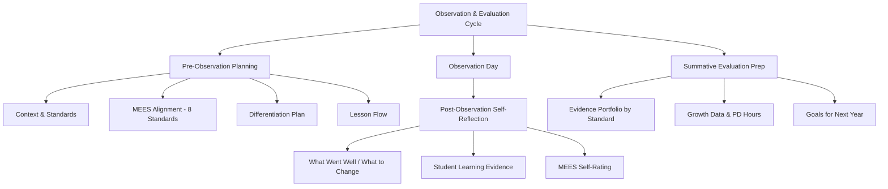

# Teacher Templates — Observation & Evaluation Prep

## Table of Contents
- [Pre-Observation Planning Guide](#pre-observation-planning-guide)
  - [Section 1: Context for the Evaluator](#section-1-context-for-the-evaluator)
  - [Section 2: Standards & Objectives](#section-2-standards-objectives)
  - [Section 3: MEES Alignment — What to Watch For](#section-3-mees-alignment-what-to-watch-for)
  - [Section 4: Differentiation Plan](#section-4-differentiation-plan)
  - [Section 5: Lesson Flow](#section-5-lesson-flow)
  - [Section 6: Questions for Post-Observation](#section-6-questions-for-post-observation)
- [Evidence Portfolio](#evidence-portfolio)
- [Data to Prepare](#data-to-prepare)
- [Talking Points for the Meeting](#talking-points-for-the-meeting)

## Pre-Observation Planning Guide

Use this to prepare for a formal observation. Aligned to the 8 Missouri Teaching Standards (MEES).

**Teacher:** ___________________________ **Date of Observation:** _______________
**Subject/Grade:** ___________________________ **Period/Time:** _______________
**Evaluator:** ___________________________ **Lesson Topic:** _______________

---

## Section 1: Context for the Evaluator

**About this class:**
- Number of students: ___
- Students with IEPs: ___ Students with 504s: ___ ELL students: ___
- Relevant context (e.g., "This is a co-taught inclusion class" / "Several students are reading 2+ grades below level" / "Class just returned from a long break"):

_______________________________________________________________________________

**Where this lesson fits:**
- Unit: _______________________________________________
- This is lesson ___ of ___ in the unit
- What students already know: _______________________________________________
- What comes next: _______________________________________________

---

## Section 2: Standards & Objectives

| Missouri Learning Standard Code | Description |
|-------------------------------|-------------|
| | |
| | |

**Learning objective(s):** Students will be able to...
1. _______________________________________________________________________________
2. _______________________________________________________________________________

**How I'll know they got it (formative assessment during the lesson):**

_______________________________________________________________________________

---

## Section 3: MEES Alignment — What to Watch For

*Highlight 2-3 standards you want the evaluator to focus on:*

| MEES Standard | What you'll see in this lesson |
|--------------|-------------------------------|
| 1. Content Knowledge | |
| 2. Student Learning | |
| 3. Curriculum Implementation | |
| 4. Critical Thinking | |
| 5. Positive Classroom Environment | |
| 6. Effective Communication | |
| 7. Student Assessment | |
| 8. Professionalism | |

---

## Section 4: Differentiation Plan

| Student Group | What I'm doing differently |
|--------------|--------------------------|
| **Advanced learners** | |
| **On-level** | |
| **Struggling / below grade** | |
| **ELL** | |
| **IEP accommodations** | |
| **504 accommodations** | |

---

## Section 5: Lesson Flow

| Time | Phase | What I do | What students do |
|------|-------|----------|-----------------|
| | Opening / bell ringer | | |
| | Introduction / hook | | |
| | Instruction (I do) | | |
| | Guided practice (We do) | | |
| | Independent practice (You do) | | |
| | Check for understanding | | |
| | Closure / exit ticket | | |

---

## Section 6: Questions for Post-Observation

*Things you want feedback on:*

1. _______________________________________________________________________________
2. _______________________________________________________________________________

---

## Post-Observation Self-Reflection

Complete this before your post-observation conference.

**Teacher:** ___________________________ **Observation Date:** _______________

## What went well?
*(Be specific — reference student actions, engagement, data)*

_______________________________________________________________________________
_______________________________________________________________________________

## What didn't go as planned?

_______________________________________________________________________________
_______________________________________________________________________________

## If I taught this lesson again, I would change

_______________________________________________________________________________
_______________________________________________________________________________

## Student learning evidence
- Exit ticket results: ___/___  students met the objective (___%)
- Observations during practice: _______________________________________________
- Surprising moment: _______________________________________________

## MEES self-rating for this lesson

| Standard | My Rating | Evidence |
|----------|-----------|---------|
| 1. Content Knowledge | ☐E ☐D ☐P ☐Dist | |
| 2. Student Learning | ☐E ☐D ☐P ☐Dist | |
| 3. Curriculum Implementation | ☐E ☐D ☐P ☐Dist | |
| 4. Critical Thinking | ☐E ☐D ☐P ☐Dist | |
| 5. Positive Classroom Environment | ☐E ☐D ☐P ☐Dist | |
| 6. Effective Communication | ☐E ☐D ☐P ☐Dist | |
| 7. Student Assessment | ☐E ☐D ☐P ☐Dist | |
| 8. Professionalism | ☐E ☐D ☐P ☐Dist | |

## Growth area I want to focus on next

_______________________________________________________________________________

---

## Summative Evaluation Prep Checklist

Use this to gather your evidence before your end-of-year summative evaluation meeting.

## Evidence Portfolio

| MEES Standard | Evidence I Can Bring | ☐ |
|--------------|---------------------|---|
| 1. Content Knowledge | Lesson plans showing standards alignment, assessment data showing student mastery, unit plans | ☐ |
| 2. Student Learning | Pre/post assessment comparison, growth data, student work samples showing progress | ☐ |
| 3. Curriculum Implementation | Unit plans, pacing guides, curriculum maps, vertical alignment work | ☐ |
| 4. Critical Thinking | Lesson plans with higher-order questions, student work showing analysis/evaluation, Socratic seminar plans | ☐ |
| 5. Positive Classroom Environment | Classroom management plan, climate survey results, SEL integration, student feedback | ☐ |
| 6. Effective Communication | Parent communication log, newsletter samples, IEP meeting participation, parent conference notes | ☐ |
| 7. Student Assessment | Assessment variety (formative + summative), rubrics, data analysis showing instructional adjustment | ☐ |
| 8. Professionalism | PD log, PLC participation, committee work, mentoring, leadership roles, collaboration evidence | ☐ |

## Data to Prepare

- [ ] Student growth data (pre-test to post-test or beginning to end of year)
- [ ] Assessment pass rates by standard
- [ ] Student feedback survey results (if collected)
- [ ] Parent communication log (# of contacts, types)
- [ ] PD hours completed this year
- [ ] PLC/team meeting participation and contributions
- [ ] Any student achievement highlights (awards, competitions, notable growth)

## Talking Points for the Meeting

**My biggest professional growth this year:**

_______________________________________________________________________________

**My impact on student learning (with data):**

_______________________________________________________________________________

**My goal for next year:**

_______________________________________________________________________________
