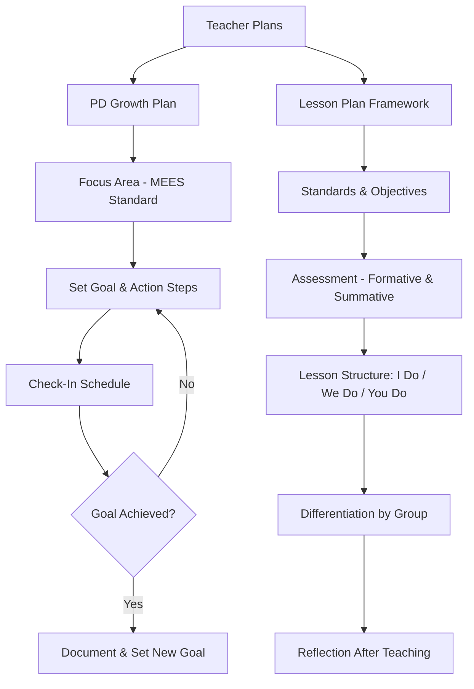

# Teacher Plans

# Professional Development Growth Plan

**Teacher:** ___________________________ **School:** ___________________________
**Evaluator/Coach:** ___________________________ **Date:** _______________
**Plan Period:** _______________ to _______________

## Focus Area
**MEES Standard:** ___ **Indicator:** ___
**Description:** ___________________________
**Current performance level:** ☐ Emerging ☐ Developing ☐ Proficient ☐ Distinguished

## Goal
*What will be different about your practice by the end of this plan?*
_______________________________________________________________________________

## Evidence of Current Performance
*What data or observations prompted this goal?*
_______________________________________________________________________________

## Action Steps
| # | What I Will Do | Resources/Support Needed | Timeline | Evidence of Completion |
|---|---------------|-------------------------|----------|----------------------|
| 1 | | | | |
| 2 | | | | |
| 3 | | | | |
| 4 | | | | |

## Success Metrics
*How will we know the goal has been achieved? What observable changes?*
_______________________________________________________________________________

## Check-In Schedule
| Date | Notes | Progress (on track / needs adjustment) |
|------|-------|---------------------------------------|
| | | |
| | | |
| | | |

## Signatures
| Role | Name | Signature | Date |
|------|------|-----------|------|
| Teacher | | | |
| Evaluator/Coach | | | |

---

# Lesson Plan Framework (Missouri Learning Standards Aligned)

**Teacher:** ___________________________ **Date(s):** _______________
**Subject:** ___________________________ **Grade:** _____
**Unit:** ___________________________

## Standards Addressed
| Code | Standard Description |
|------|---------------------|
| | |
| | |

## Learning Objectives
*Students will be able to (SWBAT):*
1. _______________________________________________________________________________
2. _______________________________________________________________________________

## Assessment
| Type | Description | When |
|------|-----------|------|
| **Formative** (check for understanding during) | | |
| **Summative** (measure mastery after) | | |

## Lesson Structure
| Phase | Time | Activity | Teacher Role | Student Role |
|-------|------|---------|-------------|-------------|
| Opening / Hook | min | | | |
| Direct instruction (I do) | min | | | |
| Guided practice (We do) | min | | | |
| Independent practice (You do) | min | | | |
| Closure / Exit ticket | min | | | |

## Differentiation
| Student Group | Modification |
|--------------|-------------|
| **Advanced / enrichment** | |
| **On-level** | |
| **Struggling / intervention** | |
| **ELL** | |
| **IEP / 504 accommodations** | |

## Materials & Resources
- 
- 
- 

## Reflection (After Teaching)
*What worked? What would you change? What do students still need?*
_______________________________________________________________________________
