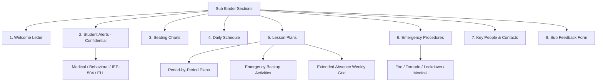

# Substitute Teacher Binder

**Purpose:** Everything a substitute needs to run your classroom for 1 day or 1 week. Build this once, update it each quarter. Keep a printed copy in a labeled binder on your desk AND a digital copy in a shared folder.

**Teacher:** ___________________________ **Room:** _____
**School:** ___________________________ **Last Updated:** _______________

## Table of Contents
- [Section 1: Welcome Letter to the Substitute](#section-1-welcome-letter-to-the-substitute)
- [Section 2: Student Alerts (CONFIDENTIAL)](#section-2-student-alerts-confidential)
  - [Medical Alerts](#medical-alerts)
  - [Behavioral / Emotional Alerts](#behavioral-emotional-alerts)
  - [IEP / 504 Accommodations the Sub Must Follow](#iep-504-accommodations-the-sub-must-follow)
  - [ELL Students](#ell-students)
- [Section 3: Seating Charts](#section-3-seating-charts)
- [Section 4: Daily Schedule](#section-4-daily-schedule)
- [Section 5: Lesson Plans](#section-5-lesson-plans)
  - [How to Use These Plans](#how-to-use-these-plans)
  - [Emergency / "Plans Fell Through" Activities](#emergency-plans-fell-through-activities)
  - [Extended Absence — Weekly Plan Grid](#extended-absence-weekly-plan-grid)
- [Section 6: Emergency Procedures](#section-6-emergency-procedures)
  - [Fire](#fire)
  - [Tornado / Severe Weather](#tornado-severe-weather)
  - [Lockdown](#lockdown)
  - [Medical Emergency](#medical-emergency)
  - [Student Leaves Without Permission](#student-leaves-without-permission)
- [Section 7: Key People](#section-7-key-people)
- [Section 8: Sub Feedback Form](#section-8-sub-feedback-form)

---

## Section 1: Welcome Letter to the Substitute

Dear Substitute Teacher,

Thank you for covering my class. This binder has everything you need. Please read this page first.

**The short version:**
- Class schedule is on the next page
- Lesson plans for each period are in Section 4
- Seating charts are in Section 3
- Student medical/behavioral alerts are in Section 2 (CONFIDENTIAL — do not share with students)
- Emergency procedures are in Section 6
- If you need help, contact **[neighbor teacher name, room ___]** first

**Classroom expectations:**
1. _______________________________________________________________________________
2. _______________________________________________________________________________
3. _______________________________________________________________________________

**What to do if a student says "we don't do it that way":**
Follow this binder. Students will test boundaries — that's normal. Be consistent, calm, and kind.

**Discipline approach:**
- First: redirect quietly
- Second: private conversation
- Third: send to **[office / neighbor teacher room ___]** with a note
- Immediately for: fighting, threats, leaving the building, medical emergency

**At the end of the day, please:**
- [ ] Leave notes about how each class went (form in Section 8)
- [ ] Note any behavior issues with names and what happened
- [ ] Lock the classroom door
- [ ] Return keys to _______________

Thank you,
[Your name]
[Your email — in case they have questions]

---

## Section 2: Student Alerts (CONFIDENTIAL)

**This page contains private student information. Do NOT share with other students. Do NOT leave this page where students can see it.**

### Medical Alerts

| Student | Period | Condition | What to Do |
|---------|--------|-----------|-----------|
| | | Severe allergy (___) | EpiPen location: ___. Call nurse immediately: ext ___ |
| | | Diabetes | May need to check blood sugar / eat snack. Nurse: ext ___ |
| | | Seizure disorder | Do not restrain. Clear area. Time the seizure. Call 911 if >5 min. Notify nurse: ext ___ |
| | | Asthma | Inhaler location: ___. Call nurse if inhaler doesn't help |
| | | | |

### Behavioral / Emotional Alerts

| Student | Period | What to Know | Strategy |
|---------|--------|-------------|---------|
| | | | |
| | | | |
| | | | |

### IEP / 504 Accommodations the Sub Must Follow

| Student | Period | Accommodations | Notes |
|---------|--------|---------------|-------|
| | | Extended time, preferential seating | Sits in front row |
| | | Breaks every 20 min | Has a pass to walk the hall for 3 min |
| | | Reduced assignment length | Give the "modified" version (marked in folder) |
| | | | |

### ELL Students

| Student | Period | WIDA Level | Key Supports |
|---------|--------|-----------|-------------|
| | | | Bilingual buddy: ___. Sentence frames in folder. |
| | | | |

---

## Section 3: Seating Charts

*(Print and attach a seating chart for each period/class. Update quarterly.)*

**Period ___:** ☐ Attached

**Period ___:** ☐ Attached

**Period ___:** ☐ Attached

**Period ___:** ☐ Attached

**Period ___:** ☐ Attached

**Period ___:** ☐ Attached

---

## Section 4: Daily Schedule

| Period / Time | Subject / Course | Room | Notes |
|--------------|-----------------|------|-------|
| | | | |
| | | | |
| | | | |
| | | | |
| | | | |
| | | | |
| | Lunch | | Lunch duty: ☐ Yes (location: ___) ☐ No |
| | | | |
| | Plan period | | No students. You can use this time for prep/break. |

**Before school duties:** _______________________________________________
**After school duties:** _______________________________________________

---

## Section 5: Lesson Plans

### How to Use These Plans

Each period has its own lesson plan on the following pages. Plans are designed to be self-contained — the sub should not need to find additional materials.

**If plans are for a single absence:** Detailed plans follow.
**If plans are for an extended absence:** See the weekly plan grid at the end of this section.

---

### Period ___: [Subject] — One-Day Plan

**Objective:** _______________________________________________

| Time | Activity | Materials | Notes for Sub |
|------|---------|-----------|--------------|
| First 5 min | Bell ringer / warm-up | On board / projected / in packet | Students know the routine |
| min | | | |
| min | | | |
| min | | | |
| Last 5 min | Clean up / exit ticket | | Collect exit tickets and leave on my desk |

**Materials location:** _______________________________________________
**Student handouts:** ☐ On desk ☐ In folder labeled ___ ☐ Students access digitally at ___
**Answer key:** ☐ In sub folder ☐ Do not grade — I will review
**What to do if students finish early:** _______________________________________________
**What to do if lesson runs short:** _______________________________________________

*(Copy this template for each period)*

---

### Emergency / "Plans Fell Through" Activities

If the lesson plans are missing or don't work, use one of these backup activities:

| Grade Level | Activity | Time | Materials |
|------------|---------|------|-----------|
| Elementary | Read-aloud + journal response | 30-45 min | Book: ___ (on desk). Journals in ___. |
| Elementary | Math fact practice + coloring sheet | 30 min | In "emergency sub" folder |
| Middle | Silent reading + summary paragraph | 40 min | Students have books. Paper in ___. |
| Middle | Vocabulary review game (instructions in folder) | 30 min | In "emergency sub" folder |
| High school | Current events article + written response | 45 min | Articles in "emergency sub" folder |
| High school | Review worksheet for current unit | 40 min | In "emergency sub" folder |

**Location of emergency sub folder:** _______________________________________________

---

### Extended Absence — Weekly Plan Grid

| Day | Period ___ | Period ___ | Period ___ | Period ___ |
|-----|----------|----------|----------|----------|
| Monday | | | | |
| Tuesday | | | | |
| Wednesday | | | | |
| Thursday | | | | |
| Friday | | | | |

**Notes for the week:** _______________________________________________

---

## Section 6: Emergency Procedures

### Fire
1. _______________________________________________________________________________
2. Exit route: _______________________________________________
3. Assembly point: _______________________________________________
4. Take: ☐ Class roster ☐ Emergency folder ☐ Phone

### Tornado / Severe Weather
1. _______________________________________________________________________________
2. Safe location: _______________________________________________
3. Students sit: _______________________________________________

### Lockdown
1. Lock the door. Turn off lights. Move students away from door/windows.
2. Do NOT open the door for anyone until an administrator gives the all-clear.
3. Take attendance. Account for all students.

### Medical Emergency
1. Call the nurse: ext ___. If life-threatening, call 911 first.
2. Send a student to the office with a note: "[Student name] needs help in room ___"
3. Do NOT move an injured student unless there is immediate danger.

### Student Leaves Without Permission
1. Do NOT chase the student.
2. Call the office immediately: ext ___
3. Note the time and direction the student went.

---

## Section 7: Key People

| Role | Name | Room / Extension | When to Contact |
|------|------|-----------------|----------------|
| Neighbor teacher (first call) | | | Any classroom question |
| Department chair | | | Curriculum or schedule questions |
| Administrator | | | Discipline, emergencies, parent calls |
| School nurse | | | Medical issues, medications |
| Front office | | | Attendance, early dismissals, supplies |
| Counselor | | | Student emotional crisis |
| Custodian | | | Cleanup emergencies |
| ESL teacher | | | ELL student support |
| Special ed contact | | | IEP accommodation questions |

---

## Section 8: Sub Feedback Form

**Substitute name:** ___________________________ **Date:** _______________

### How did each class go?

| Period | Subject | How it went (great / okay / rough) | Notes |
|--------|---------|-----------------------------------|-------|
| | | | |
| | | | |
| | | | |
| | | | |
| | | | |

### Students who were helpful
_______________________________________________________________________________

### Behavior concerns (name + what happened)
_______________________________________________________________________________
_______________________________________________________________________________

### Did students complete the work?
☐ All classes completed the assignment
☐ Most did — exceptions: _______________________________________________
☐ Many did not — here's what happened: _______________________________________________

### Were the lesson plans clear and easy to follow?
☐ Yes, no issues
☐ Mostly, but I had questions about: _______________________________________________
☐ No — here's what was confusing: _______________________________________________

### Anything else the teacher should know?
_______________________________________________________________________________
_______________________________________________________________________________

**Thank you for your notes — they make a huge difference when I return.**
